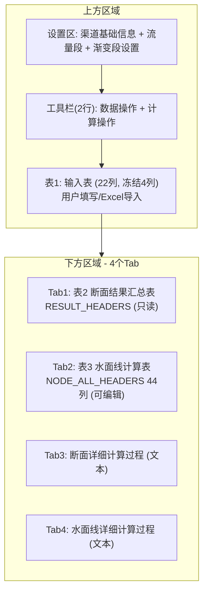
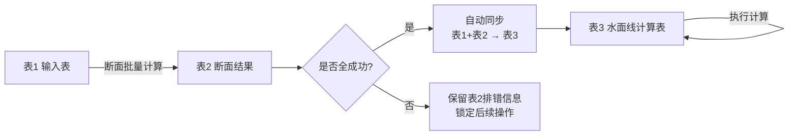
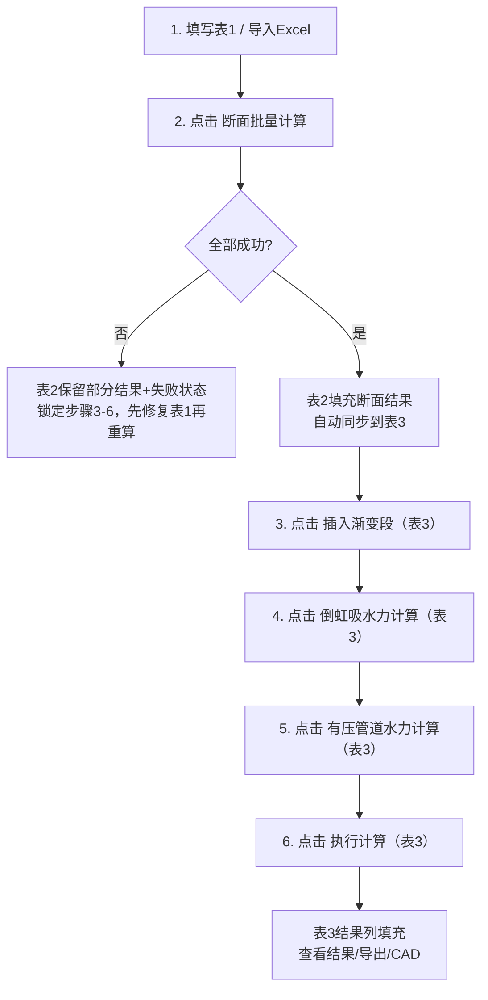

# 合并批量计算与水面线面板 — 最终设计方案（v3.1）

## v3.1 变更摘要

本版本在 v3 基础上完成两类升级：

1. **方案口径修订（消除冲突）**
   - 统一“同步时机”：仅在断面计算**全部成功**后，才允许表1+表2同步到表3。
   - 统一“失败处理”：失败时保留表2排错信息，但锁定后续链路（禁止继续操作表3下游计算）。
   - 统一“重算失效”：表1任意变更后，表2/表3立即标记过期并锁定，需重新断面计算。
2. **新增治理章节**
   - 新增 `八、上线与回滚策略（GitHub）`
   - 新增 `九、PRD复核定稿计划（v3→v3.1）`
   - 新增 `十、后续同步项（跨文档）`

---

## 一、核心架构：三表设计



**三表数据流（v3.1 定稿）**：



---

## 二、完整工作流程



**重算与失效规则（v3.1 新增）**：

- 表1任意单元格被修改后，立即标记“断面结果过期”。
- 过期状态下禁用：`插入渐变段`、`倒虹吸水力计算`、`有压管道水力计算`、`执行计算`、统一导出。
- 用户重新点击 `断面批量计算` 后，系统先清空表2与表3，再执行新一轮计算与同步。

---

## 三、设计决策总结（v3.1）

| 决策项 | 结论 |
|--------|------|
| 菜单名称 | `水面线计算`（承载断面+水面线合并能力） |
| **表1（输入表）** | 22列，沿用 `INPUT_HEADERS`，冻结4列 |
| **表2（断面结果）** | `RESULT_HEADERS`，只读，Tab1 |
| **表3（水面线表）** | `NODE_ALL_HEADERS` 44列，冻结4列，Tab2 |
| 同步时机 | 仅断面全成功后自动同步表1+表2→表3 |
| 断面失败策略 | 保留表2排错信息，锁定表3下游计算链路 |
| 失效策略 | 表1修改即使结果失效，需重新断面计算解锁 |
| 参数设置对话框 | 保留 `SectionParameterDialog`（双击/按钮） |
| 详细过程开关 | Tab3+Tab4常驻；关闭时显示“未启用详细输出”占位文本 |
| 流量设置 | WP方式（设计流量+加大流量）+ `应用到表格` + `考虑加大流量比例系数` |
| 流量段越界 | 计算前阻断并报错（如流量段=5但设计流量仅3段） |
| Q覆盖确认 | 点击 `应用到表格` 时，仅对“将被覆盖且值冲突”的行弹窗确认 |
| 渐变段设置 | 顶部 `CollapsibleGroupBox`，与现有WP一致 |
| 导出策略 | 统一导出 + 分别导出 + CAD工具栏 |
| 统一Excel内容 | 单文件多Sheet：输入表/断面结果/水面线表/摘要 |
| Word详细导出 | 同一文档包含断面详细 + 水面线详细两章 |
| 有压专用参数 | 保留能力，走行级元数据（UserRole），不新增表列 |
| 旧面板处理 | 导航隐藏，实例保留（不删除代码） |
| 项目兼容 | `.qxproj` 双写兼容，读取优先 `merged_panel` |

---

## 四、UI 详细设计

### 4.1 顶部设置区

合并两个面板设置字段为统一区域：

**渠道基础信息**：

- 渠道名称、渠道级别（下拉）、起始水位(m)、起始桩号
- 设计流量(m³/s)（逗号分隔，如 `5.0, 4.0, 3.0`）+ `应用到表格`按钮
- 加大流量(m³/s)（自动按规范计算，可手动覆盖）
- 糙率、转弯半径（含`自动`按钮）
- 倒虹吸糙率（芯片展示）、有压管道参数（芯片展示）

**渐变段设置**（`CollapsibleGroupBox`）：

- 渡槽/隧洞：进口形式+ζ₁、出口形式+ζ₂
- 明渠：型式+ζ
- 倒虹吸：进口形式+ζ₁、出口形式+ζ₂、`参考系数表`按钮

### 4.2 两行工具栏

**行1 — 数据操作**（从 batch 移植）：
`导入Excel` | `示例数据▾` | `打开Excel模板▾` | `新增行` | `插入行` | `删除行` | `复制行` | `清空表1+表2` | `参数设置`

**行2 — 计算操作**（合并后）：
`[✓] 考虑加大流量比例系数` | `[✓] 启用详细计算过程输出` | `断面批量计算` | `插入渐变段` | `倒虹吸水力计算` | `有压管道水力计算` | `执行计算` | `清空表3`

### 4.3 表1：输入表

与现有 `INPUT_HEADERS` 完全一致（22列），冻结前4列：

| 冻结列(4) | 可滚动列(18) |
|-----------|-------------|
| 序号、流量段、建筑物名称、结构形式 | X、Y、Q(m³/s)、糙率n、比降(1/)、边坡系数m、底宽B(m)、明渠宽深比、半径R(m)、直径D(m)、矩形渡槽深宽比、倒角角度(°)、倒角底边(m)、圆心角(°)、不淤流速、不冲流速、转弯半径(m)、管材 |

保留交互：结构选择器、参数对话框、Ctrl+C/V/D/Z/Y、右键菜单、粘贴验证。

### 4.4 下方结果区

**导出工具栏**：
`导出Excel报告（统一）` | `导出断面Excel` | `导出水面线Excel` | `导出详细过程(Word)`

**CAD工具栏**（沿用WP）：
`纵断面TXT` | `纵断面DXF` | `建筑物平面图` | `IP平面图` | `综合DXF`

**计算结果摘要**（沿用WP）：
`总长度: xxx m | 水位落差: xxx m | ...` + `[建筑物长度统计]`

**4个Tab**：

- **Tab1 — 表2：断面计算结果汇总表**（只读，`RESULT_HEADERS`）
- **Tab2 — 表3：水面线计算表**（44列，可编辑列不变）
- **Tab3 — 断面详细过程**（`QTextEdit`只读；关闭详细输出时显示占位说明）
- **Tab4 — 水面线详细过程**（`QTextEdit`只读；关闭详细输出时显示占位说明）

---

## 五、关键数据流

### 5.1 表1→表3 自动同步映射

仅在“断面计算全部成功”后执行，映射关系如下：

| 表1列 / 表2结果 | → 表3列 |
|----------------|---------|
| 流量段(1) | → 流量段(0) |
| 建筑物名称(2) | → 建筑物名称(1) |
| 结构形式(3) | → 结构形式(2) |
| X(4) | → X(5) |
| Y(5) | → Y(6) |
| 转弯半径(20) | → 转弯半径(7) |
| 表2.底宽B | → 底宽B(20) |
| 表2.直径D | → 直径D(21) |
| 表2.半径R | → 半径R(22) |
| 边坡系数m(9) | → 边坡系数m(23) |
| 糙率n(7) | → 糙率n(24) |
| 比降(8) | → 底坡1/i(25) |
| Q(6) | → 流量Q设计(26) |
| 表2.h设计 | → 水深h设计(27) |
| 表2.A设计 | → 面积A(28) |
| 表2.湿周 | → 湿周X(29) |
| 表2.R水力 | → 水力半径R(30) |
| 表2.V设计 | → 流速v设计(31) |

额外透传（通过 `Qt.UserRole` / 缓存）：

- 管材、局部损失比例、进出口标识 → 行元数据（UserRole）
- 建筑物总高H → `_node_structure_heights`
- V加大 → `_node_velocity_increased`
- 倒角参数 → `_node_chamfer_params`
- U形圆心角 → `_node_u_params`

### 5.2 加大流速传递链

```
表1 Q + [考虑加大流量比例系数]
→ 断面计算引擎 → 表2.V加大
→ _node_velocity_increased
→ _build_nodes_from_table() → ChannelNode.velocity_increased
→ SiphonExtractor.extract_siphons()
→ MultiSiphonDialog._build_params_from_group()
→ 倒虹吸水力计算使用
```

### 5.3 设计流量与流量段（v3.1补充规则）

- 设计流量字段（如 `5.0, 4.0, 3.0`）代表各流量段目标值。
- `应用到表格` 按流量段号写入表1 Q列。
- 当目标Q与现有Q冲突时，仅对冲突行弹窗确认覆盖。
- 若流量段号超出设计流量列表长度，计算前阻断并提示具体行号。
- 设计流量与加大流量同时写入 `ProjectSettings.design_flows/max_flows`。

---

## 六、关键文件修改

### 1. 主面板改造：`app_渠系计算前端/water_profile/panel.py`

**布局重构**

- `_build_top_area()`：合并渠道设置，加入 `应用到表格` 按钮
- `_build_input_table()`：新增表1（22列）
- `_build_toolbar_row1()`：batch数据操作按钮移植
- `_build_toolbar_row2()`：合并后的计算操作按钮
- `_build_result_area()`：4 Tab（含断面结果与断面详细过程）

**移植自 `batch/panel.py` 的能力**

- 断面批量计算主流程
- 重名校验
- 流量段应用
- Excel导入/示例数据/模板打开
- 行操作 + 快捷键 + 参数弹窗

**新增逻辑**

- `_sync_to_water_profile_table()`：断面全成功后同步表1+表2→表3
- 失败锁定与结果过期状态机
- 详细输出关闭时 Tab3/Tab4 占位文本机制

**保留WP逻辑**

- 渐变段插入、倒虹吸计算、有压管道计算、水面线执行计算
- 节点构建/设置构建/结果展示/详细报告/CAD导出

### 2. 导航栏修改：`app_渠系计算前端/app.py`

- 导航菜单合并为单入口 `水面线计算`
- 旧批量面板入口隐藏
- 旧面板实例保留（不从代码删除）
- `QStackedWidget` 索引与状态栏文案同步调整

### 3. 项目管理器：`app_渠系计算前端/project_manager.py`

**保存结构（v2）**

```json
{
  "version": "2.0",
  "merged_panel": {
    "input_table": { "rows": [] },
    "settings": {},
    "result_table": { "rows": [] },
    "water_profile_table": { "rows": [] },
    "calculated_nodes": [],
    "extra_caches": {},
    "options": { "inc_checked": true, "detail_checked": false }
  },
  "batch_panel": {},
  "water_profile_panel": {}
}
```

**兼容策略（v3.1 锁定）**

- 双写：`merged_panel` + 旧字段最小兼容集并存
- 读取优先级：`merged_panel` > 旧字段
- 双写保留周期：至少 2 个正式版本
- 要求：新版本保存项目可被旧版基本打开

### 4. 旧模块处理

- `app_渠系计算前端/batch/panel.py`：代码保留，导航不再直达
- `推求水面线/shared/shared_data_manager.py`：代码保留，合并面板内不依赖

### 5. CAD 导出：`app_渠系计算前端/water_profile/cad_tools.py`

- 继续读取 `panel.calculated_nodes` 与既有控件属性
- 新面板需维持关键属性名兼容，尽量避免改 CAD 模块
- 上线前执行一次 `panel.xxx` 引用完整性核查

### 6. 发布脚本治理：`tools/release.py`（新增）

- 增加 `--prerelease` 参数：支持分支预发布
- 增加 `--gist-target` 参数：支持正式/测试 Gist 分流
- 非 `master` 分支且非 `--prerelease` 时阻断发布

---

## 七、风险与注意事项

1. **代码量大**：`WaterProfilePanel` 单文件将继续增长，需严格分阶段合并与回归测试。
2. **列索引稳定性**：表1 22列与表3 44列索引必须冻结，避免链式回归。
3. **同步时机误用风险**：必须保证“只在断面全成功后同步”；禁止编辑态隐式同步。
4. **行级元数据丢失风险**：有压管道参数依赖 UserRole，序列化/撤销/复制操作要覆盖。
5. **加大流速链条风险**：`V加大 → _node_velocity_increased → ChannelNode` 不可断链。
6. **双写兼容风险**：若写漏旧字段，回滚后可能无法继续项目生产。
7. **发布通道风险**：预发布必须走测试 Gist，避免影响正式用户自动更新。
8. **人为决策风险**：回滚触发采用人工判断，需保证例会机制和操作记录完整。

---

## 八、上线与回滚策略（GitHub）

### 8.1 分支治理模型（定稿）

- 正式主线：`master`
- 稳定线：`release/v1-stable`（长期保留，仅收紧急修复）
- 合并候选线：`feature/merged-panel`（示例名，真实分支按团队命名规范）

**原则**：

1. 功能开发走候选分支，不直接改 `master`
2. 候选分支允许发布 `prerelease`（测试验证）
3. 正式版只从 `master` 发布
4. 缺陷修复“先稳后新”：先修稳定线，再 `cherry-pick` 到候选分支
5. 候选分支每周与 `master` 同步一次

### 8.2 基线封存与可回退点

每次合并大改开始前，执行基线封存：

```bash
git checkout master
git pull origin master
git tag -a vX.Y-pre-merge-YYYYMMDD -m "baseline before merged panel"
git push origin vX.Y-pre-merge-YYYYMMDD
git checkout -b release/v1-stable
git push -u origin release/v1-stable
```

### 8.3 预发布与正式发布通道

- 候选分支发布：必须 `prerelease=true`，并更新**测试 Gist**。
- 正式分支发布：`master` 发布正式 Release，更新**正式 Gist**。
- 预发布不修改 `version.py` 的正式版本号，通过 tag 区分测试批次。

### 8.4 回滚策略（人工判断触发）

回滚触发不设固定阈值，由负责人基于用户反馈与质量风险人工判断。

**回滚路径 A（未合并）**：关闭 PR，停止候选分支推进。  
**回滚路径 B（已合并）**：对合并提交执行 `git revert`。  
**回滚路径 C（严重异常）**：从基线 tag 拉热修分支恢复旧版。

示例：

```bash
# 路径 B：回滚已合并提交
git checkout master
git pull origin master
git revert <merge_or_squash_commit_sha>
git push origin master

# 路径 C：从基线恢复
git checkout -b hotfix/rollback-vX.Y vX.Y-pre-merge-YYYYMMDD
git push -u origin hotfix/rollback-vX.Y
```

### 8.5 候选分支“替代主干”的正确方式

不直接切默认分支。采用“**PR合并回 master**”完成主线替代：

1. 候选分支达到验收标准（功能、性能、兼容、用户反馈）
2. 从候选分支发起 PR 到 `master`
3. 合并前再打一次“最后旧版保护标签”
4. 合并后 `master` 成为新主线；`release/v1-stable` 继续保留

### 8.6 上线前强制门禁：回滚演练

每次准备正式上线前，必须完成一次演练并记录：

- 可从基线 tag 启动旧版构建
- `.qxproj` 可在旧版基本打开
- 可执行 `revert` 并恢复发布通道

### 8.7 每周 `master -> 候选分支` 同步（防漂移，带正向反馈）

- 通过 `tools/git_publish_gui.py` 执行一键同步：`git fetch` → `git checkout 候选分支` → `git merge origin/master`。
- 同步成功后，工具记录“最近同步时间 + 同步目标分支”，并在界面显示“本周已同步”状态。
- 若超过 7 天未同步，工具启动时给出显式提醒，降低“忘记同步”风险。
- 默认勾选“同步后自动推送”，保证远端候选分支与本地一致（可手动取消）。
- 保持“先稳后新”原则不变：公共缺陷先在稳定线修复，再向候选线同步（merge/cherry-pick）。

---

## 九、PRD复核定稿计划（v3→v3.1）

### 9.1 执行清单（Checklist）

| 编号 | 检查项 | 执行动作 | 通过标准 | 失败处理 |
|------|--------|----------|----------|----------|
| C1 | 同步时机一致性 | 检查流程图/决策表/数据流章节 | 全文只保留“断面全成功后同步” | 统一改写冲突语句 |
| C2 | 失败锁定策略 | 校验失败分支描述 | 失败时可排错、不可继续下游计算 | 增加锁定规则说明 |
| C3 | 结果失效策略 | 校验表1编辑后行为 | 表1变更即失效并锁定 | 增加状态机说明 |
| C4 | 流量段边界 | 校验越界场景 | 越界阻断并给行号 | 增加前置校验规则 |
| C5 | Q覆盖策略 | 校验`应用到表格`行为 | 仅冲突行弹确认 | 增加覆盖弹窗规则 |
| C6 | 详细输出行为 | 校验Tab策略 | Tab3/Tab4常驻，关闭显示占位 | 移除隐藏Tab描述 |
| C7 | 有压参数承载 | 校验字段设计 | 不新增列，元数据持续可用 | 增加UserRole约束 |
| C8 | 统一导出范围 | 校验Excel/Word导出定义 | Excel含4个核心Sheet；Word含两章详细过程 | 补齐导出结构 |
| C9 | 项目兼容 | 校验保存结构与读取优先级 | 双写+优先读merged_panel+旧版可开 | 增加兼容条款 |
| C10 | 发布回滚治理 | 校验分支/预发布/回滚条款 | 分支预发布、主干正式发布、可回滚演练 | 补充第八章策略 |

### 9.2 验收场景（功能+数据+发布全链路）

| 场景 | 验收目标 |
|------|----------|
| S1：断面全成功 | 自动同步表3，后续按钮解锁 |
| S2：断面部分失败 | 表2保留排错，后续链路锁定 |
| S3：断面后编辑表1 | 立即失效并锁定，需重算 |
| S4：流量段越界 | 计算前拦截并提示具体行 |
| S5：有压参数链路 | 参数在复制/撤销/保存后不丢失 |
| S6：统一导出 | Excel四Sheet、Word双章节完整 |
| S7：双写项目回读 | 新旧版本均可基本打开 |
| S8：预发布通道 | 仅测试Gist更新，不影响正式用户 |
| S9：回滚演练 | revert/tag回退路径可执行 |

### 9.3 已锁定默认值（决策闭环）

- 失败回滚触发：人工判断
- 稳定线策略：长期保留 `release/v1-stable`
- 候选线晋升：PR合并回 `master`
- 分支发布：仅 `prerelease`
- 缺陷流向：先稳后新
- 同步节奏：每周同步候选线
- 检查更新弹窗：采用方案 B（增加“更新通道”下拉：正式/测试）
- 测试通道权限：所有用户可切换到测试通道；必须显示“测试版可能不稳定”提示
- 降级策略：允许用户从测试构建回退到更低正式版（手动确认后安装）
- Git 暂存策略：工具默认全量暂存（`git add -A`）
- 双写周期：至少2个正式版本

---

## 十、后续同步项（跨文档）

本次仅修订本 PRD。后续需同步更新：

1. `docs/发版与自动更新指南.md`
   - 增加“分支预发布 + 测试Gist”章节
   - 明确“正式发布仅master，非master必须prerelease”
2. `tools/release.py` 使用说明
   - 新增 `--prerelease`、`--gist-target` 示例
3. 团队发布规范
   - 固化 `vX.Y-pre-merge-YYYYMMDD` 基线标签规范与回滚演练记录模板
4. `app_渠系计算前端/update_dialog.py` 与 `updater.py`
   - 同步“更新通道（正式/测试）+ 测试风险提示 + 正式通道降级入口”交互规则
5. `tools/git_publish_gui.py`
   - 固化“每周同步 master→候选分支”的执行与提醒机制
