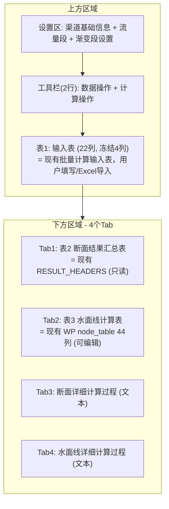
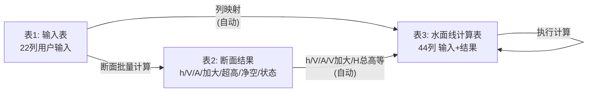
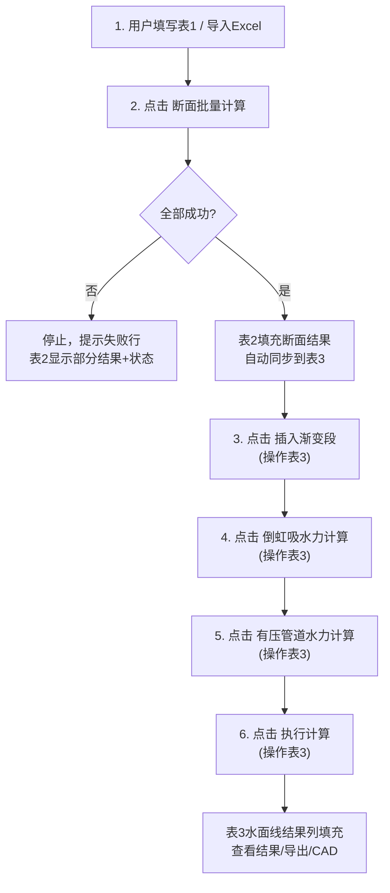

# 合并批量计算与水面线面板 — 最终设计方案（v3）

## 一、核心架构：三表设计



**三表之间的数据流**：



## 二、完整工作流程



**重新计算场景**：用户修改表1后重新点击"断面批量计算"→ 清空表2和表3 → 重新计算并同步 → 用户需重新执行步骤3-6。

## 三、设计决策总结

| 决策项 | 结论 |
|--------|------|
| 菜单名称 | "水面线计算" |
| 渠道级别标签 | "渠道级别" |
| **表1（输入表）** | 22列，和现有批量计算输入表完全一致，冻结4列（序号/流量段/名称/结构形式） |
| **表2（断面结果）** | RESULT_HEADERS，只读，在Tab1 |
| **表3（水面线表）** | NODE_ALL_HEADERS 44列，和现有WP node_table一致，在Tab2 |
| 断面计算→表3同步 | 自动（无需手动导入按钮） |
| 参数设置对话框 | 保留现有batch的方式（双击/按钮打开SectionParameterDialog），参数在表1中直接编辑 |
| 流量设置 | 用WP方式（设计流量+加大流量，逗号分隔多段）+ "应用到表格"按钮 + "考虑加大流量比例系数"复选框 |
| 渐变段设置 | 放在顶部设置区（CollapsibleGroupBox，与现有WP一致） |
| 工具栏 | 2行：数据操作 + 计算操作 |
| 冻结列 | 表1=4列（序号/流量段/名称/结构）；表3=4列（流量段/名称/结构/进出口） |
| 详细过程复选框 | 一个复选框控制Tab3+Tab4显示 |
| 导出 | 统一导出 + 分别导出 + CAD工具栏（保持现有WP位置） |
| 摘要信息 | 和现有WP一样（计算结果摘要 + 建筑物长度统计按钮） |
| 渐变段/明渠行样式 | 灰色(渐变段) / 绿色(自动明渠)，仅在表3中 |
| 断面失败处理 | 有任何行失败则全部停止 |
| 重新断面计算 | 清空表2和表3 |
| Excel导入格式 | 不变，22列（支持旧18/19列），导入到表1 |
| 实现方式 | 在现有 WaterProfilePanel 基础上改造 |
| 旧面板 | 代码保留但导航栏隐藏 |
| 项目兼容 | 向后兼容旧 .qxproj 文件 |

## 四、UI 详细设计

### 4.1 顶部设置区

合并两个面板的设置字段为统一区域：

**渠道基础信息**（合并去重后）：

- 渠道名称、渠道级别（下拉）、起始水位(m)、起始桩号
- 设计流量(m³/s)（逗号分隔，如 `5.0, 4.0, 3.0`）+ **"应用到表格"按钮**（将Q值按流量段号填入表1的Q列）
- 加大流量(m³/s)（自动从设计流量按灌排规范计算，可手动修改）
- 糙率、转弯半径（+ "自动"按钮）
- 倒虹吸糙率（芯片展示）、有压管道参数（芯片展示）

**渐变段设置**（CollapsibleGroupBox，与现有WP完全一致）：

- 渡槽/隧洞：进口形式+ζ₁ / 出口形式+ζ₂
- 明渠：型式+ζ
- 倒虹吸：进口形式+ζ₁ / 出口形式+ζ₂ + "参考系数表"按钮

### 4.2 两行工具栏

**行1 — 数据操作**（从batch移植）：
`导入Excel` | `示例数据▾` | `打开Excel模板▾` | `新增行` | `插入行` | `删除行` | `复制行` | `清空输入` | `参数设置`

**行2 — 计算操作**（合并两面板）：
`[✓] 考虑加大流量比例系数` | `[✓] 启用详细计算过程输出` | `断面批量计算` | `插入渐变段` | `倒虹吸水力计算` | `有压管道水力计算` | `执行计算`

### 4.3 表1：输入表

与现有批量计算 `INPUT_HEADERS` 完全一致（22列），冻结前4列：

| 冻结列(4) | 可滚动列(18) |
|-----------|-------------|
| 序号、流量段、建筑物名称、结构形式 | X、Y、Q(m³/s)、糙率n、比降(1/)、边坡系数m、底宽B(m)、明渠宽深比、半径R(m)、直径D(m)、矩形渡槽深宽比、倒角角度(°)、倒角底边(m)、圆心角(°)、不淤流速、不冲流速、转弯半径(m)、管材 |

保留现有batch的所有交互：双击结构形式弹出选择器、双击参数列弹出SectionParameterDialog、Ctrl+C/V/D/Z/Y快捷键、右键菜单、粘贴验证等。

### 4.4 下方结果区

**导出工具栏**：
`导出Excel报告（统一）` | `导出断面Excel` | `导出水面线Excel` | `导出详细过程(Word)` | `清空结果`

**CAD工具栏**（与现有WP一致）：
`纵断面TXT` | `纵断面DXF` | `建筑物平面图` | `IP平面图` | `综合DXF`

**计算结果摘要**（与现有WP一致）：
`总长度: xxx m | 水位落差: xxx m | ...` + `[建筑物长度统计]`按钮

**4个Tab**：

- **Tab1 — 表2：断面结果汇总表**
  和现有 `RESULT_HEADERS` 一致，只读：
  序号 / 流量段 / 建筑物名称 / 结构形式 / 底宽B / 直径D / 半径R / h设计 / V设计 / A设计 / R水力 / 湿周 / Q加大 / h加大 / V加大 / 超高Fb / 建筑物总高H / 设计净空高度 / 加大净空高度 / 设计净空比例 / 加大净空比例 / 状态

- **Tab2 — 表3：水面线计算表**
  和现有 `NODE_ALL_HEADERS` 一致（44列），冻结前4列（流量段/名称/结构/进出口）；
  断面计算后自动填充输入列和设计工况结果（h/V/A等）；
  "插入渐变段"在此表中插入渐变段行；
  "执行计算"填充此表的几何结果/水头损失/高程列；
  可编辑列：基础输入(0-7) + 水力输入(20-26) + 预留/过闸/倒虹吸水头损失(36-38)

- **Tab3 — 断面详细过程**：QTextEdit 只读（受复选框控制）

- **Tab4 — 水面线详细过程**：QTextEdit 只读（受复选框控制）

## 五、关键数据流

### 5.1 表1→表3 自动同步映射

断面计算全部成功后，自动执行（复用现有 `_import_from_batch` 的映射逻辑）：

| 表1列 / 表2结果 | → 表3列 |
|----------------|---------|
| 流量段(1) | → 流量段(0) |
| 建筑物名称(2) | → 建筑物名称(1) |
| 结构形式(3) | → 结构形式(2) |
| X(4) | → X(5) |
| Y(5) | → Y(6) |
| 转弯半径(20) | → 转弯半径(7) |
| 表2.底宽B | → 底宽B(20) |
| 表2.直径D | → 直径D(21) |
| 表2.半径R | → 半径R(22) |
| 边坡系数m(9) | → 边坡系数m(23) |
| 糙率n(7) | → 糙率n(24) |
| 比降(8) | → 底坡1/i(25) |
| Q(6) | → 流量Q设计(26) |
| 表2.h设计 | → 水深h设计(27) |
| 表2.A设计 | → 面积A(28) |
| 表2.湿周 | → 湿周X(29) |
| 表2.R水力 | → 水力半径R(30) |
| 表2.V设计 | → 流速v设计(31) |

额外透传（通过 UserRole / 缓存）：

- 管材、局部损失比例、进出口标识 → `Qt.UserRole` on row
- 建筑物总高H → `_node_structure_heights`
- V加大 → `_node_velocity_increased`
- 倒角参数 → `_node_chamfer_params`
- U形圆心角 → `_node_u_params`

### 5.2 加大流速传递链

```
表1 Q值 + "考虑加大流量比例系数"复选框
→ 断面计算引擎 → V加大 (表2中显示)
→ 同步到 _node_velocity_increased 缓存
→ _build_nodes_from_table() → ChannelNode.velocity_increased
→ SiphonExtractor.extract_siphons() → SiphonGroup.upstream/downstream_velocity_increased
→ MultiSiphonDialog._build_params_from_group() → v_channel_in_inc / v_pipe_out_inc
→ 倒虹吸水力计算使用
```

### 5.3 设计流量与流量段

- 设计流量字段（如 `5.0, 4.0, 3.0`）= 各流量段的设计流量
- "应用到表格"按钮：将设计流量按流量段号填入表1的Q列（和现有batch `_apply_flow_segments` 一致）
- 加大流量字段：自动按灌排规范从设计流量计算（和现有WP `_on_design_flow_changed` 一致）
- 两个字段值同时写入 `ProjectSettings`（`design_flows` / `max_flows`），供水面线计算使用

## 六、关键文件修改

### 1. 主面板改造：`app_渠系计算前端/water_profile/panel.py`

核心改动（~5000行文件）：

**布局重构**：

- `_build_top_area()`：合并渠道基础信息（加入"应用到表格"按钮、加大流量比例系数复选框）
- 新增 `_build_input_table()`：创建表1（22列 FrozenColumnTableWidget，复用batch的表格配置）
- 新增 `_build_toolbar_row1()`：数据操作按钮（从batch移植）
- 修改 `_build_toolbar_row2()`：计算操作按钮（合并两面板）
- 修改 `_build_result_area()`：4个Tab（新增Tab1断面结果表 + Tab3断面详细过程）

**从 `batch/panel.py` 移植的代码**：

- `_batch_calculate()` / `_calculate_single()` / `_extract_result_row()`：断面批量计算核心逻辑
- `_validate_duplicate_buildings()`：重名验证
- `_apply_flow_segments()`：流量段应用到表格
- `_import_from_excel()` / `_do_load_from_filepath()`：Excel导入
- `_add_sample_data()`：示例数据
- `_open_excel_template_file()`：打开模板
- 行操作：新增行/插入行/删除行/复制行/清空
- 快捷键：Ctrl+C/V/D/A/Z/Y
- `SectionParameterDialog` 集成

**新增逻辑**：

- `_sync_to_water_profile_table()`：断面计算成功后自动同步表1+表2→表3（替代现有 `_import_from_batch`）
- 断面结果列的"锁定"逻辑：断面有失败行时禁用后续操作按钮

**保留的现有WP逻辑**（操作表3）：

- `_insert_transitions()`：插入渐变段
- `_open_siphon_calculator()`：倒虹吸水力计算
- `_open_pressure_pipe_calculator()`：有压管道水力计算
- `_calculate()`：执行计算（水面线推求）
- `_build_nodes_from_table()` / `_build_settings()`
- `_display_results()` / `_generate_detail_report()`
- 所有 CAD 导出相关方法

### 2. 导航栏修改：`app_渠系计算前端/app.py`

- `modules` 列表：替换两个菜单项为 `("水面线计算", "断面计算与水面线推求")`
- 旧面板实例化代码保留但注释掉（或保留在内存中不加入 stack）
- `QStackedWidget` 索引调整
- 状态栏文字更新

### 3. 项目管理器：`app_渠系计算前端/project_manager.py`

**新保存格式**：

```json
{
  "version": "2.0",
  "merged_panel": {
    "input_table": { "rows": [...] },
    "settings": { "channel_name": "...", "design_flows": "...", ... },
    "result_table": { "rows": [...] },
    "water_profile_table": { "rows": [...] },
    "calculated_nodes": [...],
    "extra_caches": { "structure_heights": {...}, ... },
    "options": { "inc_checked": true, "detail_checked": false }
  }
}
```

**向后兼容加载**：

- 检测 `version`
- 旧格式（version < 2.0）：从 `batch_panel.input_rows` → 表1；从 `batch_panel` 设置 → 设置区；从 `water_profile_panel` → 表3+渐变段设置
- 新格式：直接加载

### 4. 旧面板处理

- `app_渠系计算前端/batch/panel.py`：代码保留不删除，导航栏不再引用
- `推求水面线/shared/shared_data_manager.py`：代码保留，合并面板内部不再使用

### 5. CAD 导出：`app_渠系计算前端/water_profile/cad_tools.py`

- CAD 代码读取 `panel.calculated_nodes` 和 `panel.xxx_edit` 等属性
- 只要新面板保留相同属性名，CAD 代码**无需修改**
- 需验证所有 `panel.xxx` 引用在新面板中都存在

## 七、风险与注意事项

1. **代码量**：WaterProfilePanel 约 5000 行 + batch 移植约 1500 行核心代码 + 新增同步逻辑约 300 行 = 预计 6500-7000 行。建议分步实施。
2. **列索引稳定性**：表1保持batch的22列索引不变；表3保持WP的44列索引不变。两表独立，互不影响。这是三表设计的重要优势——**避免了列索引全面重编的风险**。
3. **同步时机**：表1→表3同步只在断面计算成功后触发。重新断面计算会清空表3（用户需重做后续步骤）。
4. **行级元数据**：表3的 UserRole 和 `_node_*` 缓存在同步时从表2结果中构建。
5. **加大流速链条**：从表2.V加大 → `_node_velocity_increased` → ChannelNode → 倒虹吸，不能打断。
6. **Undo/Redo**：表1和表3各自独立的撤销栈。表3的撤销包含渐变段插入操作。
7. **Excel模板文件**：`data/` 目录下现有模板不需修改。
