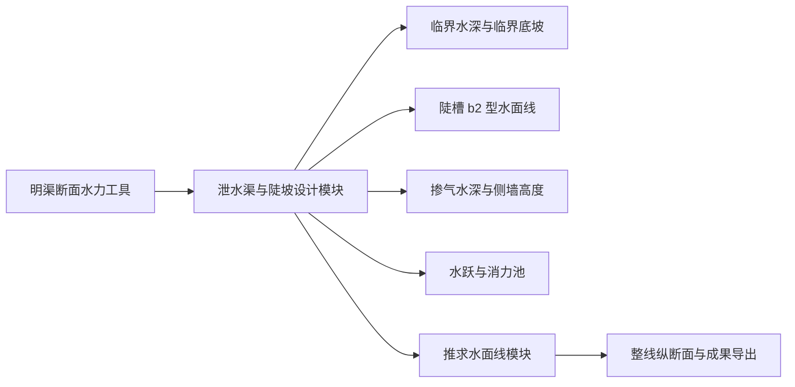

# 泄水渠与陡坡水力计算模块 — 产品需求文档 (PRD)

> **版本**: v2.0  
> **创建日期**: 2026-05-12  
> **最后更新**: 2026-05-13  
> **状态**: 第二版正式模块已实现，已完成输入栏组件体系对齐、加大流量输入对齐、自动分级流量、计算原理预览、计算原理段落符号下标渲染、上下游衔接、掺气侧墙、水跃消能、出口整流、多流量控制、表3轻量接口、出处清洗、纵断面图图形与文字裁切修复、导出入口对齐、计算书开头固定格式对齐和代码评审修复
> **推荐定位**: 独立渠系建筑物设计模块，复用明渠断面水力工具，并与“推求水面线”模块轻量集成

---

## 实现同步说明（2026-05-12，第二版正式模块）

### 已实现范围

- 已把 **“泄水渠与陡坡”** 从第一版试验界面升级为正式模块界面；左侧输入栏已使用与明渠、渡槽一致的 Fluent 输入框和白色输入卡片，工况条、结果导航、网页结果页、图形工具栏和工况对比表按渡槽、隧洞同类模块风格统一，首个默认工况显示为“工况1”，并提供新手/专业模式切换。
- 用户可见界面、图题、图例、空状态、表头、按钮、提示、导出章节已改为中文；输入栏补齐“清空”按钮，导出入口统一为“导出计算书”和“导出表格”，公式页和结果页中的核心公式统一通过现有公式渲染器输出。
- 输入结构已扩展到第二版：设计流量、加大流量、自动分级流量、水面线模式、起点控制水深、上游衔接、下游尾水、材料允许流速、掺气系数、安全超高、消力池系数和出口整流参数。
- 加大流量输入已与明渠、渡槽等设计面板对齐，复用共享输入口径：支持“按比例 / 按Q加大”，比例留空自动查表，按Q加大时反算比例并校验 \(Q_{\text{加大}}>Q\)；旧工程的 `increase_percent / increase_flow` 字段可恢复到新输入模式。
- 计算内核已保留第一版入口 `quick_calculate_spillway_steep_chute(...)`，并扩展返回上游衔接、下游水跃、消力池、掺气侧墙、多流量控制、表3轻量接口和计算原理所需的结构化结果。
- 水面线型识别已覆盖 \(a_1\)、\(b_1\)、\(c_1\)、\(a_2\)、\(b_2\)、\(c_2\) 和临界坡特殊情况；标准自由陡坡仍按 \(b_2\) 主线计算。
- 上游缓坡自由接陡坡时，陡槽入口默认取 \(h_k\)，上游普通缓坡末端正常水深只作为校核提示；人工控制、进口控制和模型试验水深可覆盖默认值。
- 陡坡出口已按跃前水深计算跃前流速、\(Fr_1\)、跃后共轭水深、下游控制水深、尾水判断、建议消力池长度、建议池深和出口整流段。
- 掺气与侧墙按逐点 \(h_b=\left(1+\frac{\zeta v}{100}\right)h\) 计算，并输出掺气水面线、侧墙顶线和建议侧墙高度。
- 多流量控制已按设计流量的 10% 到 100% 自动初筛，并将加大流量自动加入控制工况比较；程序会在初筛控制工况邻近区间按设计流量的 1% 自动加密，再取控制要求最大的工况作为消力池控制工况。
- 表3接口已按“结构化结果轻量接入”实现，提供入口、出口、沿程采样点和警告，不把每个沿程点拆成正式表3节点。
- Word 和表格导出已升级为第二版计算书口径，包含计算原理、结果汇总、沿程水面线、上下游衔接、消能与出口、多流量控制、表3轻量接口、规范校核和风险提示；计算原理展示与导出会清洗内部 PRD 表述，只保留规范、理论或工程校核口径；计算原理页已支持计算前预览态，未点击“计算”前先展示完整流程、公式、变量含义、来源和当前输入，正式结果统一标注“计算后生成”；计算原理页的变量含义、本次代入、计算结果和原理说明会把 \(h_s\)、\(Q_{\text{过流}}\)、\(E_s\) 等工程符号按下标显示，且不会把普通说明整体交给公式引擎；Word 导出已接入与明渠一致的工程计算书固定格式，开头包含产品运行卡、封面、强制性条文校审检查表、目录、计算目的、计算依据、基本资料和计算程序，并支持项目设置、计算目的、计算依据和多工况范围；计算书和表格保存对话框会按当前工程或工况自动预填文件名，用户可自行修改，保存成功后会询问是否直接打开，表格导出路径固定补齐 `.xlsx` 后缀。
- 纵断面图已接入共享画布布局和文字安全布局，窄窗口、切页和项目恢复后会按当前可视区域刷新画布，并按标题、坐标轴标题、刻度和图例的真实渲染边界自动留白，避免图框、图例、曲线末端或中文文字被裁切；该修复不是固定加大左边距补丁。
- 代码评审修复已补齐：非法输入时项目保存不丢原始工况、新建项目可重置本模块、亚临界或水面线失败时不输出水跃设计尺寸、表3轻量接口不再把失败起点伪装为可用、两水深模式尊重明确起点水深、导出保留合法 0 值、纵断面保留 0 桩号起点。

### 未实现边界

- 消力槛式、综合式、台阶式、加糙式和多级消能仍属于第三版或专项结构设计范围。
- 线性扩散陡槽、非棱柱体陡槽和完整表3正式节点接入仍保留为后续范围。
- 当前水跃和消力池尺寸为初步水力设计口径，重要工程仍需专项复核或模型试验。
- 当前不新增 DXF 成果图，纵断面图仅作为界面图形展示和导出参考。

### 验收结果

- 本轮三项对齐修复回归：`101` 个测试通过。
- 本轮输入栏组件体系对齐回归：`38` 个相关测试通过；泄水渠专项回归：`56` 个测试通过。
- 关联界面回归：本轮未重复运行，沿用前次结果导航、断面图、渡槽断面图、隧洞断面图共 `219` 个测试通过记录。
- 验证命令继续使用项目虚拟环境，并关闭当前环境中会导致收尾卡住的 `hypothesispytest` 插件。

## 实现同步说明（2026-05-12，第一版试验模块）

### 已实现范围

- 已新增独立页面 **“泄水渠与陡坡”**，作为试验模块接入主窗口导航，不改变现有“推求水面线”表3主链路。
- 已新增计算内核 `calc_渠系计算算法内核/泄水渠与陡坡设计.py`，复用明渠断面面积、湿周、水力半径、曼宁流量和正常水深求解能力。
- 第一版支持矩形、梯形、等宽棱柱体陡槽，可计算正常水深、临界水深、临界底坡、坡型、弗劳德数、断面比能、水力坡度、入口宽顶堰过流能力和规范提示。
- 已实现三种水面线模式：已知长度求终点水深、已知两端水深求长度、由起点推到正常水深附近的全段曲线。
- 已提供熊启钧棱柱体陡坡教学算例、计算原理、结果汇总、沿程水面线、纵断面图、规范校核、工况对比、项目保存恢复、Word 和 Excel 导出。
- 报告依据已接入 `report_meta.py`，包含 GB 50288-2018、熊启钧专著和明渠非均匀流理论默认文本。

### 第一版历史边界与第二版补齐情况

- 暂不把本模块作为表3正式结构类型接入，也不自动生成整线纵断面 DXF。
- 暂不做线性扩散、非棱柱体陡槽、台阶式/加糙式陡坡、多级跌水、斜管式跌水和跌井的完整计算。
- 第二版已补齐掺气水深、侧墙高度、水跃、平底消力池初步尺寸和出口整流段；复杂消力池结构和扩散陡槽仍为后续范围。
- 暂不替代大流量、高跌差或重要工程的专项复核、水工模型试验和更高等级规范校核。

### 验收口径

- 熊启钧教学算例采用 \(Q=20m^3/s\)、\(b=1.0m\)、\(m=1.5\)、\(i=1/50\)、\(n=0.014\)、\(L=80m\)，末端水深按 \(1.199m\pm0.08m\) 验收。
- 非陡坡工况不得静默按陡坡计算水面线，只输出 \(h_0\)、\(h_k\)、\(i_k\)、坡型和风险提示。
- 新模块测试使用 `tests/test_spillway_steep_chute_*.py`；当前测试环境中 `hypothesispytest` 插件会导致 pytest 进程收尾不退出，验证时使用 `-p no:hypothesispytest` 关闭该插件。

## 当前设计同步说明（2026-05-12）

- 本模块不建议作为现有“明渠水力计算”的普通子项实现，而应作为独立的 **“跌水与陡坡 / 泄水渠设计”** 模块。
- 模块内部应复用明渠断面几何、水力半径、正常水深、临界水深、弗劳德数等通用能力，避免重复编写断面公式。
- 模块结果应能接入“推求水面线”模块，但“推求水面线”不应直接承担完整陡槽水面线、掺气、水跃和消力池设计计算。
- 第一版重点解决陡坡泄水渠的核心问题：确定泄(退)水设计流量，校核跌口 / 陡坡入口过流能力，判断是否为陡坡，计算临界水深、正常水深、临界底坡，按分段法推求陡槽 \(b_2\) 型降水水面线，并输出沿程水深、水位、流速、弗劳德数和规范布置校核表。
- 第二版再补齐掺气水深、侧墙高度、出口水跃、平底矩形消力池初步尺寸、出口连接整流段和多流量分级控制。
- 对流量大、跌差大、高流速或重要工程，程序只能提供设计计算和风险提示，不能替代水工模型试验或更高等级规范复核。

## 当前设计同步说明（2026-05-12，专著复核）

- 熊启钧《灌区建筑物的水力计算与结构计算》进一步印证：陡坡渠槽在 \(h_k>h>h_0\) 区间为 \(b_2\) 型降水曲线，上端与跌水或坡度由缓变陡处相接，水深近似取临界水深，下端渐近正常水深。
- 专著给出 \(Q=20m^3/s\)、梯形陡槽 \(b=1.0m\)、\(m=1.5\)、\(i=1/50\)、\(n=0.014\)、首端水深 \(h_k=1.788m\)、长度约 \(80m\) 时，末端水深约 \(1.199m\) 的算例，可作为第一版水面线回归测试用例。
- 专著还给出非棱柱体扩散陡槽的分段求和算例，说明第一版虽然可先做等宽棱柱体陡槽，但 PRD 需要预留“线性扩散 / 非棱柱体陡槽”计算模式。
- 专著对消能计算提出重要补充：闸后或池前有陡坡连接段时，应先推算陡坡段末端收缩水深，再计算相应跃后水深；否则忽略陡坡段摩阻损失会使消力池深或消力槛高偏大。
- 专著补充了消力池出口控制水深口径：若消力池出口后下游尾水深小于出口断面的临界水深，出口相当于非淹没宽顶堰，应以临界水深作为下游控制水深，而不是直接采用较小的实际尾水深。

## 当前设计同步说明（2026-05-12，第一版范围调整）

- 第一版水面线计算范围调整为三种模式全部实现：已知起点水深和长度求终点水深、已知两端水深求水面线长度、已知起点水深求全段 \(H-L\) 曲线。
- 第一版和当前第二版仍限定为矩形 / 梯形、等宽棱柱体陡槽；线性扩散 / 非棱柱体陡槽保留到后续专项版本。

## 当前设计同步说明（2026-05-12，GB 50288 终审）

- GB 50288-2018 第 6.3.6 条要求先明确泄(退)水渠道设计流量和允许不冲流速口径，因此 PRD 最终版新增“泄(退)水设计流量规范提示”和“材料允许流速 / 泄水渠允许不冲流速提示”。
- GB 50288-2018 第 12.1 条和第 12.2 条要求跌水与陡坡按进口连接控制段、跌墙或陡槽段、消力池、出口连接整流段四段理解，因此 PRD 最终版不再只把本模块看成一段陡槽，而是输出四段式成果结构和规范校核表。
- GB 50288-2018 第 12.3 条规定水力设计包括过流能力、陡槽水面线、掺气水深、水跃及消能计算，因此 PRD 最终版把“跌口 / 陡坡入口宽顶堰过流能力校核”纳入第一版基础闭环，把掺气、侧墙、消能和出口整流放入第二版完整闭环。
- GB 50288-2018 对直线段、轴线、进口收缩角、陡槽扩散角、纵坡范围、湿周限制、消力池初拟条件、出口整流、防渗排水和材料强度均有明确要求，因此 PRD 最终版新增“规范布置校核”能力；第一版先做提示和合规检查，第二版再做完整尺寸计算。

## 当前设计同步说明（2026-05-12，新手引导增强）

- 第一版必须提供“新手快速算例”入口，用户可一键载入熊启钧专著中的棱柱体陡坡算例，最快完成一次完整计算。
- 所有关键输入字段必须提供“怎么取值”说明，至少说明推荐来源、默认取值、适用边界和对应规范或理论依据。
- 结果区必须提供“计算原理”页签，位于“结果汇总”之前；页面按计算流程展示公式、变量含义、本次代入值、计算结果、原理说明和来源；普通说明文字中的工程符号也必须正确显示下标。
- 新手模式不降低计算严谨性，只减少第一次上手时需要人工判断的内容；专业模式仍保留全部参数。

## 当前设计同步说明（2026-05-12，第二版上下游衔接增强）

- 第一版正在开发中，仍按 GB 50288-2018 第 12.3.3 条的标准陡坡场景实现：陡槽起点取临界水深，向下游推求 \(b_2\) 型降水水面线。
- 第二版必须补充“为什么默认用 \(b_2\)”和“什么时候不是 \(b_2\)”的专业解释与程序判断：水面线型式由底坡类型和实际水深相对 \(h_0\)、\(h_k\) 的位置共同决定。
- 第二版必须支持上游普通缓坡渠道接陡坡的边界衔接口径：标准自由衔接时，陡槽起点仍以临界水深作为控制水深；上游缓坡渠末不应直接用均匀流正常水深接入陡槽，而应以该临界水深作为下游边界反推 \(b_1\) 型降水水面线。
- 第二版必须支持陡坡后接普通缓坡渠道的水跃衔接口径：不能把陡坡末端急流水深直接交给缓坡渠道递推，而应先以陡坡末端水深作为跃前水深，计算跃后共轭水深，再与下游尾水深或正常水深比较，判断水跃位置、淹没状态和是否需要消力池。
- 若存在闸门控制、进口孔流、下游淹没、强急变流、非标准衔接或重要大跌差工程，第二版应允许使用实际控制断面水深或试验 / 专项复核结果覆盖默认临界水深假设。

---

## 一、模块背景

### 1.1 问题来源

当前系统已经具备普通明渠设计能力，也具备整条渠道的水面线推求能力。但泄水渠、陡坡、跌水这类建筑物具有明显不同的水力特征：

- 底坡常见为 \(1/20\)、\(1/50\)、\(1/100\)，明显大于普通输水明渠。
- 水流往往由缓流过渡为急流，或者在陡槽段内保持急流。
- 水深沿程快速变化，不能只按普通明渠均匀流处理。
- 出口常需要判断水跃、消力池和下游防冲。
- 高速水流还涉及掺气、空化、边墙加高、槽底加糙等问题。

普通明渠设计模块主要回答：

$$
Q=\frac{1}{n} A R^{2/3} i^{1/2}
$$

即在给定流量、糙率和坡度条件下，某个断面能否满足过流和流速要求。

泄水渠与陡坡模块需要回答的是：

$$
h(s),\quad Z_w(s),\quad v(s),\quad Fr(s),\quad h_b(s),\quad h_c'',\quad L_d,\quad d_d
$$

即水深、水位、流速、流态、掺气水深、水跃后水深、消力池长度和池深如何沿流程变化。

因此，本模块应独立建模。

### 1.2 现有系统边界

| 现有模块 | 当前定位 | 与本模块关系 |
|---|---|---|
| 明渠水力计算 | 普通明渠单断面设计，重点是断面尺寸、水深、流速、超高 | 提供可复用的断面几何和均匀流计算能力 |
| 推求水面线 | 按节点推求整条渠道的水位、渠底、渠顶和损失 | 接收本模块计算结果，用于全线路纵断面展示 |
| 渐变段与明渠段插入 | 处理不同建筑物之间的连接段和渐变段 | 后续可识别陡坡与上下游明渠之间的连接关系 |
| 泄水闸 | 当前在推求水面线中作为点状闸类结构 | 后续可与本模块组成“泄水闸 + 陡坡泄水渠 + 消力池”的组合链路 |

---

## 二、设计依据

### 2.1 教材依据

依据《水力学第五版上册》中明渠流动相关理论，重点采用以下内容：

| 理论内容 | 用途 |
|---|---|
| 断面比能与临界水深 | 判别临界流，确定陡槽起算控制水深 |
| 弗劳德数 | 判别缓流、临界流和急流 |
| 临界底坡、缓坡与陡坡 | 判断实际底坡是否为水力学意义上的陡坡 |
| 明渠恒定非均匀渐变流水面曲线 | 推求陡槽段 \(b_2\) 型降水曲线 |
| 逐段试算法 | 对陡槽水面线进行数值计算 |
| 水跃理论 | 判断陡槽出口是否需要消能，并估算跃后水深 |

### 2.2 规范依据

依据 GB 50288-2018《灌溉与排水工程设计标准》，重点采用以下内容：

| 条文位置 | 对本模块的作用 |
|---|---|
| §3.1.6 | 跌水与陡坡等渠系建筑物的级别应结合设计流量确定，程序需保留工程级别字段和重要工程提示 |
| §6.2.6 | 明确干渠、支渠及重要渠段需要设置泄水渠、闸或退水设施 |
| §6.3.6 | 确定泄(退)水渠道设计流量、允许不冲流速、纵横断面和出口衔接口径 |
| §12.1 | 明确跌水与陡坡的组成、布置场景和基本形式 |
| §12.1.3 | 明确低跌差可采用单级跌水，高跌差宜采用多级跌水或陡坡，斜管式跌水和跌井用于特殊场景 |
| §12.1.5 | 明确跌水与陡坡宜布置在直线段，上下游直线段长度宜大于渠道底宽的 10 倍，轴线宜一致 |
| §12.2.1 | 明确总体布置原则：水力条件、平顺衔接、防渗排水、充分消能和合理出路 |
| §12.2.2 | 侧墙高度应考虑实际加大水深、允许壅水、掺气水深和安全超高 |
| §12.2.3 | 明确进口连接控制段长度、收缩角、纵坡和跌口形式要求 |
| §12.2.4 | 陡槽宜直线布置，宜采用矩形断面，纵坡宜取 \(1:2.5\sim1:50\)，高流速需考虑掺气、加糙、台阶等措施 |
| §12.2.6 | 消力池宽度、长度、深度和下游防冲要求 |
| §12.2.7 | 明确出口连接段和出口整流段的设置条件、收缩角和长度要求 |
| §12.2.8 | 明确跌差大、地下水位高或地基抗渗性差时应设置防渗排水设施 |
| §12.2.9 | 明确多级跌水 / 多级陡坡的级差、整流段和末级尾水口径 |
| §12.2.10～§12.2.11 | 明确斜管式跌水和跌井的适用边界，可作为选型提示而非第一版计算对象 |
| §12.3.2 | 过水能力应按跌口断面采用宽顶堰公式计算，多级建筑物由最小一级过流能力控制 |
| §12.3.3 | 陡槽以陡槽起点为控制断面，取临界水深，向下游推求 \(b_2\) 型降水水面线 |
| §12.3.4 | 掺气水深按附录 N 计算 |
| §12.3.5 | 分流量级进行水跃计算，按控制工况设计消力池 |
| §12.4.1、§12.4.7 | 提示抗冲耐磨材料最低强度和高跌差、大流量陡坡需按 SL 253 复核 |
| 附录 N | 跌水与陡坡过流、水面线、掺气和消能计算 |

### 2.3 专著补充依据

依据熊启钧《灌区建筑物的水力计算与结构计算》，本模块增加以下补充口径：

| 内容 | 对本模块的作用 |
|---|---|
| 棱柱体渠槽水面线型式 | 明确陡坡渠槽 \(b_2\) 型降水曲线的适用区间为 \(h_k>h>h_0\) |
| 棱柱体渠槽水力指数法 | 可作为等宽陡槽水面线的校核方法和算例来源 |
| 非棱柱体渠槽分段求和法 | 支持后续扩散陡槽、变底宽陡槽的水面线计算 |
| 明渠非均匀流程序的三类计算 | 支持“已知两端水深求长度”“已知起点水深和距离求终点水深”“已知起点水深求全段曲线”三种模式 |
| 消能计算程序说明 | 闸后或池前存在陡坡连接段时，应先推求陡坡段末端水深，再进行水跃和消力池计算 |
| 消力池出口控制水深 | 当下游尾水深小于出口临界水深时，应以出口临界水深作为消力池下游控制水深 |

### 2.4 GB 50288 终审对照结论

本次将 GB 50288-2018 与 PRD 逐条互相印证后，确认原 PRD 的水面线理论方向正确，但偏重“陡槽段内部计算”，对泄(退)水建筑物的完整设计闭环还需补齐以下内容：

| GB 要求 | 原 PRD 状态 | 终极版处理 |
|---|---|---|
| 泄(退)水渠道设计流量应按设置位置确定 | 已提到但未形成输入和校核 | 新增泄水渠设计流量取值方式、上游 / 下游渠道设计流量字段和规范提示 |
| 跌水与陡坡由进口连接控制段、跌墙或陡槽段、消力池、出口连接整流段组成 | 主要聚焦陡槽段 | 新增四段式成果结构和规范校核表 |
| 单级跌水、多级跌水、陡坡、斜管式跌水、跌井有不同适用场景 | 已有结构类型枚举，但缺少选型逻辑 | 新增形式选择建议，斜管式跌水和跌井先作为提示与后续模块 |
| 上下游直线段、轴线、折线布置需校核 | 未覆盖 | 新增直线段长度、轴线一致性和折线折冲波风险提示 |
| 进口段长度、收缩角、跌口形式和进口纵坡需校核 | 未覆盖 | 新增进口连接控制段输入和校核 |
| 过流能力应按宽顶堰公式计算 | 第一版未纳入 | 新增跌口 / 陡坡入口过流能力校核，第一版即输出过流能力比 |
| 陡槽扩散角、纵坡范围、湿周限制、材料允许流速和变形缝需提示 | 只覆盖流速风险 | 新增陡槽布置校核；结构缝、止水、防滑齿墙只做设计提示 |
| 消力池初拟需校核单宽流量、跃前弗劳德数、宽度、长度和池深 | 已有水跃与池长池深，缺少布置条件 | 新增消力池布置校核，第二版完整启用 |
| 出口连接整流段、防渗排水、材料强度和 SL 253 复核需提示 | 未覆盖或较弱 | 新增出口整流、防渗排水、材料强度和高跌差大流量复核提示 |

---

## 三、模块定位

### 3.1 推荐架构

本模块采用 **独立模块 + 共享明渠内核 + 接入推求水面线** 的架构。



### 3.2 不采用“明渠子模块”的原因

泄水渠与陡坡虽然属于明渠水流，但工程设计问题已经从“单断面过流能力”变成“沿程急流水面线和消能衔接”。

如果直接塞进明渠设计模块，会导致：

- 普通明渠界面被过多专业参数干扰。
- 明渠计算内核承担过多水面线和消能职责。
- 后续水跃、消力池、掺气、空化、加糙扩展缺少清晰边界。
- 与推求水面线的整线成果衔接会变得含混。

### 3.3 不完全并入“推求水面线”的原因

推求水面线模块当前主要是按节点进行水位递推和损失汇总，它不适合作为完整的陡坡设计工具。

如果直接并入推求水面线，会导致：

- 表3节点逻辑被陡槽内部大量采样点污染。
- 现有“水位 = 上游水位 - 水头损失”的递推口径无法直接表达陡槽内急流降水曲线。
- 用户在设计一个泄水渠时，不一定已经有完整渠线数据。
- 消力池、掺气、侧墙高度等专项结果很难在表3里清楚展示。

### 3.4 最终定位

本模块定位为：

> 面向泄水渠、跌水与陡坡的专项水力计算模块，独立完成陡槽水面线、掺气、水跃和消能初步设计，并将结果以结构物成果或沿程采样点形式提供给推求水面线模块使用。

---

## 四、目标与非目标

### 4.1 产品目标

第一阶段目标：

1. 支持按 GB 50288-2018 第 6.3.6 条给出泄(退)水渠道设计流量取值提示。
2. 支持单级跌水、多级跌水、陡坡、斜管式跌水和跌井的形式选择建议，其中第一版只计算陡坡泄水渠主体。
3. 按进口连接控制段、陡槽段、消力池、出口连接整流段建立四段式成果结构。
4. 支持跌口 / 陡坡入口宽顶堰过流能力校核，并输出设计流量与可过流量的关系。
5. 提供新手快速算例、一键载入示例参数、字段取值说明和计算原理说明。
6. 支持矩形和梯形陡槽断面。
7. 支持输入设计流量和加大流量；程序自动按设计流量的 10% 到 100% 生成初筛流量，并在控制区间按 1% 加密。
8. 自动计算临界水深 \(h_k\)、正常水深 \(h_0\)、临界底坡 \(i_k\)。
9. 自动判断渠道属于缓坡、临界坡还是陡坡。
10. 对陡坡段按规范简化口径取起点水深：

   $$
   h_{\text{start}} = h_k
   $$

11. 采用逐段法向下游推求陡槽 \(b_2\) 型降水水面线。
12. 输出沿程桩号、渠底高程、水深、水位、流速、弗劳德数、水力坡度等结果。
13. 输出规范布置校核表，覆盖直线段、轴线、进口段、陡槽段、消力池、出口整流、防渗排水和材料提示。
14. 对高流速、非陡坡、过大跌差、接近临界流等情况给出风险提示。
15. 支持把结果保存到项目文件，并可被推求水面线引用。

第二阶段目标：

1. 计算掺气水深。
2. 估算侧墙高度。
3. 进行出口水跃判断。
4. 支持平底矩形消力池初步计算。
5. 支持按多级流量选择消力池控制工况。
6. 支持导出 Word、Excel、DXF/TXT 纵断面成果。

第三阶段目标：

1. 支持多级跌水、多级陡坡。
2. 支持台阶式、加糙式、扩散式陡坡的扩展参数。
3. 支持与泄水闸、退水闸、排洪闸形成组合设计链路。
4. 支持重要工程的“需模型试验”提示和专门复核报告。

### 4.2 非目标

第一版不做以下内容：

- 不进行结构配筋、抗滑、抗倾覆、地基承载力验算。
- 不进行完整空化数、脉动压力和高速水流细部结构验算。
- 不替代水工模型试验。
- 不处理复杂三维急流、弯道折冲波和非对称扩散流。
- 不自动设计泄水闸、侧堰或排洪闸；本模块只校核跌口或陡坡入口控制段的过流能力。
- 不完整设计斜管式跌水和跌井，第一版只给出适用性提示，后续作为独立扩展。
- 不把陡槽内部采样点全部变成推求水面线表3的正式可编辑节点。

---

## 五、用户场景

### 5.1 场景 A：独立设计一条泄水渠

用户已知：

- 泄水设计流量。
- 上游渠底或水位。
- 下游沟道或下游渠道高程。
- 地形允许的陡槽长度或落差。
- 初拟陡槽底宽、边坡、坡度和糙率。

用户希望得到：

- 这个坡度是否属于陡坡。
- 陡槽内水面线如何变化。
- 最大流速在哪里。
- 是否需要考虑掺气、加糙或台阶。
- 出口是否需要消力池。

### 5.2 场景 B：在整条渠道水面线中插入陡坡

用户在“推求水面线”中已有完整渠线，希望某一段从普通明渠变成陡坡泄水渠。

用户希望：

- 表3里能标记该段为“陡坡”或“泄水渠-陡坡”。
- 双击该结构物可打开专项计算结果。
- 整线纵断面图能显示陡槽内部水面线。
- 下游水位递推能接上陡槽出口结果。

### 5.3 场景 C：泄水闸后接泄水渠

用户在干渠或支渠上设置泄水闸，闸后需要将水送入下游沟道。

用户希望：

- 先按规范确定泄水渠设计流量。
- 闸后接陡坡或跌水。
- 先推求陡坡段末端水深，再判断水跃和消力池。
- 成果能在报告中形成“泄水闸 + 陡坡泄水渠 + 消力池”的连续说明。

### 5.4 场景 D：比较多个坡度方案

用户希望对比：

- \(1/20\)
- \(1/30\)
- \(1/50\)
- \(1/100\)

并查看各方案的：

- 陡槽长度。
- 出口流速。
- 最大掺气水深。
- 侧墙高度。
- 消力池规模。
- 风险提示。

---

## 六、术语与符号

| 符号或术语 | 含义 | 单位 |
|---|---|---|
| \(Q\) | 设计流量 | \(m^3/s\) |
| \(Q_d\) | 泄(退)水渠道设计流量 | \(m^3/s\) |
| \(Q_j\) | 第 \(j\) 个自动分级流量，初筛按 \(0.1jQ\) 取值，控制区间按 \(0.01Q\) 加密 | \(m^3/s\) |
| \(b\) | 矩形底宽或梯形底宽 | m |
| \(b_c\) | 矩形或台堰形跌口宽度 | m |
| \(b_d\) | 陡坡底宽 | m |
| \(m\) | 梯形边坡系数 | - |
| \(\mu\) | 矩形或台堰形跌口流量系数 | - |
| \(\varepsilon\) | 边界收缩系数 | - |
| \(H_0\) | 计入堰前流速水头的堰上水头 | m |
| \(n\) | 糙率 | - |
| \(i\) | 陡槽底坡 | - |
| \(L\) | 陡槽长度 | m |
| \(\Delta Z\) | 上下游渠底落差 | m |
| \(A\) | 过水面积 | \(m^2\) |
| \(\chi\) | 湿周 | m |
| \(R\) | 水力半径 | m |
| \(B\) | 水面宽 | m |
| \(D_h\) | 水力水深，\(D_h=A/B\) | m |
| \(h\) | 水深 | m |
| \(h_0\) | 正常水深 | m |
| \(h_k\) | 临界水深 | m |
| \(i_k\) | 临界底坡 | - |
| \(v\) | 平均流速 | m/s |
| \(Fr\) | 弗劳德数 | - |
| \(J\) | 水力坡度 | - |
| \(E_s\) | 断面比能 | m |
| \(Z_b\) | 渠底高程 | m |
| \(Z_w\) | 水位 | m |
| \(h_b\) | 掺气水深 | m |
| \(h_c'\) | 消力池前或陡槽末端跃前水深 | m |
| \(h_c''\) | 水跃后共轭水深 | m |
| \(h_s\) | 下游渠道水深 | m |
| \(L_d\) | 消力池长度 | m |
| \(d_d\) | 消力池深度 | m |
| \(L_r\) | 出口整流段或级间整流段长度 | m |
| \(F_b\) | 安全超高 | m |

---

## 七、功能范围

### 7.1 第一版功能清单

| 功能 | 必须实现 | 说明 |
|---|---:|---|
| 矩形陡槽 | 是 | 第一版优先支持 |
| 梯形陡槽 | 是 | 土基或一般护砌陡槽常用 |
| 棱柱体等宽陡槽 | 是 | 第一版主计算对象 |
| 线性扩散陡槽 / 非棱柱体陡槽 | 后续专项 | 用于对接“末端与消力池等宽”或扩散式陡槽 |
| 复式梯形、圆形、U形 | 否 | 后续复用明渠断面后再扩展 |
| 单工况计算 | 是 | 一个设计流量下完整计算 |
| 加大流量计算 | 是 | 与明渠模块口径保持一致 |
| 多工况对比 | 是 | 至少支持多个坡度或多个流量方案 |
| 新手快速算例 | 是 | 一键载入熊启钧专著棱柱体陡坡算例，完成首次计算 |
| 字段取值说明 | 是 | 每个关键字段提供推荐来源、默认值、适用边界和出处 |
| 计算原理页签 | 是 | 位于“结果汇总”之前，公式用 LaTeX 渲染，并展示流程、变量含义、本次代入、结果、原理说明和来源 |
| 新手 / 专业模式切换 | 是 | 新手模式减少必填项，专业模式显示全部参数 |
| 泄(退)水设计流量规范提示 | 是 | 按渠首、分水建筑物上游、无分水建筑物、末端退水等场景提示 |
| 建筑物形式选择建议 | 是 | 根据跌差、渠道级别、寒冷地区、覆土或交通要求提示单级跌水、多级跌水、陡坡、斜管式跌水、跌井 |
| 四段式成果结构 | 是 | 进口连接控制段、陡槽段、消力池、出口连接整流段 |
| 跌口 / 陡坡入口过流能力校核 | 是 | 按宽顶堰公式校核 \(Q_{\text{cap}}\geq Q_d\) |
| 进口连接控制段布置校核 | 是 | 校核进口长度、收缩角、纵坡和跌口形式，第一版先输出提示 |
| 陡槽布置校核 | 是 | 校核扩散角、纵坡范围、湿周限制、允许流速和高流速措施 |
| 出口连接整流段校核 | 第二版 | 第一版先提示设置条件，第二版计算长度和衔接尺寸 |
| 防渗排水与材料提示 | 是 | 只做规范提示，不进行结构设计 |
| 上游缓坡接陡坡衔接 | 第二版 | 识别上游普通渠道末端以陡槽入口临界水深为下游控制边界，必要时反推 \(b_1\) 型水面线 |
| 陡坡接下游缓坡衔接 | 第二版 | 以陡坡末端水深为跃前水深，计算水跃和尾水控制，判断是否需要消力池 |
| 其他水面线型识别 | 第二版 | 识别 \(a_1,b_1,c_1,a_2,b_2,c_2\) 等型式并解释适用场景，避免把所有工况误判为 \(b_2\) |
| 已知起点水深和长度求终点水深 | 是 | 第一版主模式之一 |
| 已知两端水深求水面线长度 | 是 | 用于方案反算和校核 |
| 已知起点水深求全段 \(H-L\) 曲线 | 是 | 计算至接近正常水深 |
| 临界水深 | 是 | 支持通用断面数值求解 |
| 正常水深 | 是 | 用曼宁公式数值求解 |
| 临界底坡 | 是 | 用临界水深对应水力要素计算 |
| 陡坡判别 | 是 | 比较 \(i\) 与 \(i_k\) |
| \(b_2\) 型水面线 | 是 | 按逐段法推求 |
| 沿程结果表 | 是 | 桩号、水深、水位、流速、Fr |
| 风险提示 | 是 | 高速、非陡坡、接近临界、超允许流速等 |
| 掺气水深 | 第二版 | 可先预留字段 |
| 侧墙高度 | 第二版 | 可先预留字段 |
| 水跃与消力池 | 第二版 | 可先输出“需复核”提示 |
| 消力槛式 / 综合式消力池 | 第三版 | 作为平底矩形消力池后的扩展 |
| 推求水面线接入 | 第一版轻量，第二版完整 | 第一版保存结果，第二版进入表3联动 |

### 7.2 第一版最小闭环

第一版必须形成以下闭环：


---

## 八、输入需求

### 8.1 基本信息

| 字段 | 类型 | 必填 | 默认值 | 说明 |
|---|---|---:|---|---|
| 工程名称 | 文本 | 否 | 空 | 用于报告标题 |
| 结构名称 | 文本 | 是 | 泄水渠1 | 保存和接入水面线时使用 |
| 结构类型 | 枚举 | 是 | 陡坡 | 可选：泄水渠-陡坡、单级跌水、多级陡坡 |
| 建筑物形式 | 枚举 | 是 | 陡坡 | 可选：单级跌水、多级跌水、陡坡、斜管式跌水、跌井 |
| 渠道级别 | 枚举 | 否 | 空 | 用于提示 4 级、5 级渠道上的斜管式跌水或跌井适用性 |
| 建筑物级别 | 枚举 | 否 | 自动提示 | 可按设计流量和现有工程等级规则确定 |
| 设计阶段 | 枚举 | 否 | 初步设计 | 影响报告文字，不影响计算 |
| 规范口径 | 枚举 | 是 | GB 50288-2018 | 暂只支持 GB 50288-2018 |

### 8.2 流量输入

| 字段 | 类型 | 必填 | 默认值 | 校验 |
|---|---|---:|---|---|
| 设计流量 \(Q\) | 数值 | 是 | 无 | 必须 \(>0\) |
| 是否考虑加大流量 | 布尔 | 否 | 是 | 与明渠模块保持一致 |
| 加大流量方式 | 枚举 | 否 | 按比例 | 按比例、按 Q 加大 |
| 加大比例 | 数值 | 条件必填 | 自动查表或空 | 必须 \(\geq0\) |
| 加大后总流量 | 数值 | 条件必填 | 空 | 必须 \(>Q\) |
| 自动分级流量 | 数组 | 否 | 程序自动生成 | 先按 \(0.1Q\sim1.0Q\) 每 10% 一档初筛，再按 \(0.01Q\) 加密控制区间用于消力池控制工况 |
| 泄退水设置位置 | 枚举 | 否 | 人工指定 | 可选：渠首段、分水建筑物上游、无分水建筑物渠段、调节流量泄水渠、渠道末端退水 |
| 上游渠道设计流量 | 数值 | 条件必填 | 空 | 用于分水建筑物上游泄水渠校核 |
| 下游最大一条渠道设计流量 | 数值 | 条件必填 | 空 | 用于分水建筑物上游泄水渠校核 |
| 所在渠段设计流量 | 数值 | 条件必填 | 空 | 用于无分水建筑物渠段或末端退水校核 |
| 泄水渠设计流量取值方式 | 枚举 | 否 | 自动提示 | 可选：按规范推荐、人工指定 |

泄水渠设计流量可提供规范提示：

- 分水建筑物上游泄水渠道，可按下游最大一条渠道设计流量，或上游渠道设计流量确定，但不应小于上游渠道设计流量的 50%。
- 附近无分水建筑物的泄水渠道，设计流量宜与该段渠道设计流量相同；确有困难时不宜小于该段渠道设计流量的 50%。
- 用于调节渠道流量的泄水渠道，条数可按需要设置，各泄水渠道设计流量可按等于或略小于所在渠段设计流量提示。
- 末端退水设施可按不小于所在渠段设计流量 50% 的口径提示。
- 泄(退)水渠道允许不冲流速可按相同条件下灌溉渠道的 \(1.1\sim1.2\) 倍提示，最终仍需结合材料抗冲允许流速校核。

### 8.3 陡槽几何输入

| 字段 | 类型 | 必填 | 默认值 | 说明 |
|---|---|---:|---|---|
| 断面形式 | 枚举 | 是 | 矩形 | 第一版支持矩形、梯形 |
| 陡槽几何模式 | 枚举 | 是 | 棱柱体等宽 | 可选：棱柱体等宽、线性扩散 |
| 底宽 \(b\) | 数值 | 是 | 无 | 必须 \(>0\) |
| 起点底宽 \(b_1\) | 数值 | 条件必填 | 同 \(b\) | 线性扩散模式使用 |
| 末端底宽 \(b_2\) | 数值 | 条件必填 | 同 \(b\) | 线性扩散模式使用 |
| 单侧扩散角 | 数值 | 否 | 自动计算 | 第二版校核是否满足规范扩散角 |
| 边坡 \(m\) | 数值 | 梯形必填 | 0 | 矩形断面取 0 |
| 糙率 \(n\) | 数值 | 是 | 0.014 | 必须 \(>0\) |
| 水面线计算模式 | 枚举 | 是 | 已知起点水深和长度求终点水深 | 可选：求终点水深、求水面线长度、求全段 \(H-L\) 曲线 |
| 坡度输入方式 | 枚举 | 是 | 坡度倒数 | 可选：坡度倒数、直接坡度、上下游渠底高差 |
| 坡度倒数 \(1/i\) | 数值 | 条件必填 | 50 | 必须 \(>0\) |
| 直接坡度 \(i\) | 数值 | 条件必填 | 空 | 必须 \(>0\) |
| 陡槽长度 \(L\) | 数值 | 条件必填 | 空 | 与高差至少填一个 |
| 渠底落差 \(\Delta Z\) | 数值 | 条件必填 | 空 | 与长度至少填一个 |
| 起点渠底高程 \(Z_{b0}\) | 数值 | 是 | 0.000 | 用于水位和纵断面 |
| 起点桩号 | 数值 | 否 | 0.000 | 用于沿程表 |
| 计算步长 | 数值 | 否 | 自动 | 可按长度或水深变化自动生成 |

第一版和当前第二版开放“棱柱体等宽 + 三种水面线计算模式”。线性扩散相关字段先保存数据结构，后续专项版本再启用。

长度、坡度和落差关系：

$$
\Delta Z = iL
$$

若用户填写其中两个量，程序自动推导第三个量；若三个都填写，应校验是否一致。

### 8.4 进口、选型与布置校核输入

| 字段 | 类型 | 必填 | 默认值 | 说明 |
|---|---|---:|---|---|
| 总跌差 \(P\) | 数值 | 否 | 由地形推导 | 用于单级跌水、多级跌水或陡坡形式建议 |
| 是否寒冷地区 | 布尔 | 否 | 否 | 用于斜管式跌水和跌井适用性提示 |
| 是否有覆土 / 保温 / 交通要求 | 布尔 | 否 | 否 | 用于斜管式跌水适用性提示 |
| 上游直线段长度 | 数值 | 否 | 空 | 用于校核是否大于上游渠道底宽的 10 倍 |
| 下游直线段长度 | 数值 | 否 | 空 | 用于校核是否大于下游渠道底宽的 10 倍 |
| 上下游轴线是否一致 | 布尔 | 否 | 是 | 不一致时提示折冲波和防冲措施风险 |
| 是否折线布置 | 布尔 | 否 | 否 | 折线布置时提示需采取防折冲水流措施 |
| 地基类型 | 枚举 | 否 | 一般土基 | 可选：土基、岩基、软弱地基、抗渗性差地基 |
| 地下水位情况 | 枚举 | 否 | 一般 | 可选：低、高、不明 |
| 土壤内摩擦角 | 数值 | 否 | 空 | 用于校核陡槽坡角是否超过地基土壤内摩擦角 |
| 进口连接段长度 | 数值 | 否 | 自动提示 | 用于按上游渠道 \(B/h\) 校核 |
| 进口底边收缩角 | 数值 | 否 | 空 | 宽浅渠道宜小于 \(45^{\circ}\) |
| 渠外溢流堰后单侧收缩角 | 数值 | 否 | 空 | 堰顶较长时每侧宜不大于 \(22^{\circ}\) |
| 进口控制段纵坡 | 数值 | 否 | 空 | 渠外跌水与陡坡进口控制段宜小于临界坡 |
| 跌口形式 | 枚举 | 否 | 矩形 | 可选：矩形、台堰形、梯形、复式跌口 |
| 跌口宽度 \(b_c\) | 数值 | 条件必填 | 同陡槽底宽 | 用于宽顶堰过流能力校核 |
| 堰前水深 \(h_1\) | 数值 | 条件必填 | 空 | 用于计算 \(H_0\) |
| 堰前平均流速 \(V_1\) | 数值 | 否 | 自动计算 | 用于计算 \(H_0\) |
| 进口连接形式 | 枚举 | 否 | 扭曲面连接 | 可选：扭曲面连接、八字墙连接、横隔墙连接、人工系数 |
| 边界收缩系数 \(\varepsilon\) | 数值 | 否 | 1.0 | 用于宽顶堰过流能力校核 |
| 陡槽末端是否与消力池等宽 | 布尔 | 否 | 是 | 用于提示线性扩散或末端衔接 |
| 下游防冲能力 | 枚举 | 否 | 不明 | 可选：好、一般、差、不明 |

### 8.5 上下游条件

| 字段 | 类型 | 必填 | 默认值 | 说明 |
|---|---|---:|---|---|
| 起点控制水深方式 | 枚举 | 是 | 取临界水深 | 可选：取临界水深、人工指定、由进口控制段计算 |
| 人工起点水深 | 数值 | 条件必填 | 空 | 高级模式 |
| 上游衔接渠道类型 | 枚举 | 否 | 普通缓坡渠道 | 第二版用于判断是否需要以上游 \(b_1\) 水面线反推衔接 |
| 上游渠道末端已算水深 | 数值 | 否 | 空 | 第二版用于校核既有推求水面线结果；不默认作为陡槽起点水深 |
| 上游渠道正常水深 | 数值 | 否 | 空 | 第二版可由上游普通明渠参数计算或由推求水面线模块传入 |
| 上游渠道临界水深 | 数值 | 否 | 空 | 第二版用于判断上游末段 \(b_1\) 型降水曲线 |
| 下游渠道水深 \(h_s\) | 数值 | 否 | 空 | 第二版用于水跃和消力池 |
| 下游渠道水位 | 数值 | 否 | 空 | 可反算 \(h_s\) |
| 下游渠底高程 | 数值 | 否 | 空 | 与下游水位共同确定下游水深 |
| 下游尾水来源 | 枚举 | 否 | 下游渠道正常水深 | 第二版可选：下游正常水深、已知水位、推求水面线结果、用户指定 |
| 下游渠道正常水深 | 数值 | 否 | 空 | 第二版用于陡坡出口水跃衔接判断 |
| 是否直接接普通缓坡渠道 | 布尔 | 否 | 是 | 第二版用于启用陡坡出口急流转缓流的水跃衔接校核 |
| 材料允许流速 | 数值 | 否 | 空 | 用于超速提示 |
| 是否重要工程 | 布尔 | 否 | 否 | 影响提示等级 |

### 8.6 掺气与侧墙输入（第二版）

| 字段 | 类型 | 必填 | 默认值 | 说明 |
|---|---|---:|---|---|
| 是否计算掺气水深 | 布尔 | 否 | 是 | 第二版启用 |
| 掺气系数 \(\zeta\) | 数值 | 否 | 1.2 | 可选范围 \(1.0\sim1.4\) |
| 允许壅水高度 | 数值 | 否 | 0.0 | 侧墙高度组成部分 |
| 安全超高 | 数值 | 否 | 0.4 | 规范宜取 \(0.3m\sim0.5m\) |

### 8.7 数值计算参数

| 字段 | 类型 | 必填 | 默认值 | 说明 |
|---|---|---:|---|---|
| 临界水深动能修正系数 \(\alpha_k\) | 数值 | 否 | 1.0 | 临界水深和临界底坡使用 |
| 水面线动能修正系数 \(\alpha_e\) | 数值 | 否 | 1.1 | 非均匀流水面线使用，专著算例常用 \(1.05\sim1.1\) |
| 消能动能修正系数 \(\alpha_j\) | 数值 | 否 | 1.05 | 水跃和消力池使用 |
| 流速系数 \(\varphi\) | 数值 | 否 | 0.95 | 第二版消能计算使用 |
| 水跃淹没系数 \(\sigma_0\) | 数值 | 否 | 1.05 | 第二版消力池计算使用，可在 \(1.05\sim1.10\) 内选取 |

---

## 九、输出需求

### 9.1 重点结果汇总

每个工况应输出一张重点结果汇总表：

| 类别 | 字段 |
|---|---|
| 基本结果 | 断面形式、流量、底宽、边坡、糙率、底坡、长度、落差 |
| 坡型判断 | 正常水深 \(h_0\)、临界水深 \(h_k\)、临界底坡 \(i_k\)、实际底坡 \(i\)、坡型 |
| 水面线型 | 第一版输出标准 \(b_2\)；第二版输出 \(a_1,b_1,c_1,a_2,b_2,c_2\) 型识别和适用说明 |
| 起点结果 | 起点水深、起点水位、起点流速、起点 \(Fr\) |
| 末端结果 | 末端水深、末端水位、末端流速、末端 \(Fr\) |
| 上游衔接 | 第二版输出上游缓坡是否应以临界水深作为下游控制边界 |
| 下游衔接 | 第二版输出跃前水深、跃后水深、下游尾水深、水跃状态和是否需要消力池 |
| 控制结果 | 最大流速、最大 \(Fr\)、最小水深、最大掺气水深 |
| 安全提示 | 是否超允许流速、是否需掺气、是否需消能、是否建议模型试验 |

### 9.2 沿程水面线表

沿程表每一行对应一个计算采样点：

| 字段 | 说明 |
|---|---|
| 序号 | 采样点编号 |
| 桩号 | 沿陡槽方向距离 |
| 渠底高程 \(Z_b\) | 按底坡计算 |
| 水深 \(h\) | 分段法计算结果 |
| 水位 \(Z_w\) | \(Z_w=Z_b+h\) |
| 过水面积 \(A\) | 由断面几何计算 |
| 湿周 \(\chi\) | 由断面几何计算 |
| 水力半径 \(R\) | \(R=A/\chi\) |
| 水面宽 \(B\) | 由断面几何计算 |
| 流速 \(v\) | \(v=Q/A\) |
| 弗劳德数 \(Fr\) | 判别流态 |
| 水力坡度 \(J\) | 由曼宁公式反算 |
| 断面比能 \(E_s\) | \(E_s=h+\alpha v^2/(2g)\) |
| 掺气水深 \(h_b\) | 第二版输出 |
| 备注 | 接近临界、接近正常水深、超速等 |

### 9.3 图形输出

第一版至少输出：

- 陡槽纵断面图。
- 渠底线。
- 临界水深线。
- 正常水深线。
- 计算水面线。
- 采样点标记。

第二版增加：

- 掺气水面线。
- 侧墙顶线。
- 消力池示意线。
- 跃前、跃后水深标记。

### 9.4 规范校核表

第一版应输出一张“规范校核表”，用于把 GB 50288-2018 的硬性或建议性要求转成用户可理解的结果。校核表不替代人工审查，但能避免漏项。

| 校核类别 | 校核内容 | 第一版处理 |
|---|---|---|
| 泄水渠设计流量 | 按渠首段、分水建筑物上游、无分水建筑物渠段、调节泄水渠、末端退水等场景提示 \(Q_d\) 合理范围 | 必须输出 |
| 建筑物形式 | 按跌差、渠道级别、寒冷地区、覆土 / 保温 / 交通要求提示形式选择 | 必须输出 |
| 四段式组成 | 进口连接控制段、陡槽段、消力池、出口连接整流段是否都有成果或提示 | 必须输出 |
| 上下游布置 | 上下游直线段是否满足 \(L_{\text{straight}}>10B\)，轴线是否一致 | 必须输出 |
| 进口连接控制段 | 进口连接段长度、收缩角、进口纵坡、跌口形式是否合理 | 必须输出 |
| 过流能力 | 按宽顶堰公式校核 \(Q_{\text{cap}}\geq Q_d\) | 必须输出 |
| 陡槽段 | 单侧扩散角是否小于 \(11^{\circ}\)，纵坡是否在 \(1:2.5\sim1:50\) 建议范围内，湿周是否满足限制 | 必须输出 |
| 流速与材料 | 最大流速是否超过材料允许流速，是否超过 \(10m/s\) | 必须输出 |
| 消力池 | 单宽流量、跃前弗劳德数、池宽、池长、池深是否满足初拟要求 | 第二版完整输出，第一版提示 |
| 出口连接整流段 | 是否需要出口连接段或整流段，长度是否满足要求 | 第二版完整输出，第一版提示 |
| 防渗排水 | 大跌差、高地下水位、软弱或抗渗性差地基是否提示防渗排水 | 必须输出 |
| 结构与材料 | 抗冲耐磨材料、变形缝、止水、防滑齿墙、SL 253 复核等提示 | 必须输出提示，不做结构验算 |

### 9.5 风险提示

程序应按严重程度给出提示：

| 等级 | 示例 |
|---|---|
| 信息 | 本工况按临界水深作为陡槽起点水深 |
| 注意 | 泄水渠设计流量低于 GB 50288-2018 推荐下限，请复核设置位置和取值依据 |
| 注意 | 跌口或陡坡入口过流能力小于设计流量 |
| 注意 | 上下游直线段长度不足 \(10B\)，或建筑物轴线与上下游渠道轴线不一致 |
| 注意 | 实际底坡未大于临界底坡，不宜按陡坡 \(b_2\) 曲线处理 |
| 警告 | 末端流速超过材料允许流速 |
| 警告 | 流速大于 \(10m/s\)，应考虑掺气、加糙或台阶等减蚀措施 |
| 警告 | 陡槽单侧扩散角不满足小于 \(11^{\circ}\) 的建议要求 |
| 警告 | 地下水位高、地基软弱或抗渗性差，应设置防渗排水设施 |
| 严重 | 重要工程且跌差大，应准确计算控制断面水深或进行水工模型试验 |
| 严重 | 高跌差、大流量陡坡宜按 SL 253 进一步复核 |
| 严重 | 计算过程中水深接近 0 或数值发散，当前参数不适合继续计算 |

---

## 十、核心计算理论

### 10.1 断面几何

矩形断面：

$$
A=bh
$$

$$
\chi=b+2h
$$

$$
R=\frac{A}{\chi}
$$

$$
B=b
$$

梯形断面：

$$
A=(b+mh)h
$$

$$
\chi=b+2h\sqrt{1+m^2}
$$

$$
R=\frac{A}{\chi}
$$

$$
B=b+2mh
$$

水力水深：

$$
D_h=\frac{A}{B}
$$

### 10.2 流速与弗劳德数

平均流速：

$$
v=\frac{Q}{A}
$$

通用断面的弗劳德数：

$$
Fr=\frac{v}{\sqrt{gD_h}}
$$

其中：

$$
D_h=\frac{A}{B}
$$

流态判别：

| 条件 | 流态 |
|---|---|
| \(Fr<1\) | 缓流 |
| \(Fr=1\) | 临界流 |
| \(Fr>1\) | 急流 |

### 10.3 正常水深

采用曼宁公式：

$$
Q=\frac{1}{n}AR^{2/3}i^{1/2}
$$

给定 \(Q,n,i\) 和断面尺寸后，通过数值法求解 \(h_0\)。

计算函数应求解：

$$
f(h)=\frac{1}{n}A(h)R(h)^{2/3}i^{1/2}-Q=0
$$

若 \(i\leq0\)，不计算正常水深，并提示平坡或逆坡不存在正常水深。

### 10.4 临界水深

通用断面的临界水深满足：

$$
\frac{\alpha Q^2}{g}=\frac{A_k^3}{B_k}
$$

即求解：

$$
f(h)=\frac{A(h)^3}{B(h)}-\frac{\alpha Q^2}{g}=0
$$

矩形断面可直接计算：

$$
h_k=\sqrt[3]{\frac{\alpha q^2}{g}}
$$

其中：

$$
q=\frac{Q}{b}
$$

梯形断面用数值法求解。

临界水深默认动能修正系数：

$$
\alpha_k=1.0
$$

高级模式允许用户改为 \(1.05\)、\(1.10\) 或人工输入。水面线计算和消能计算不强制共用该值，分别采用 \(\alpha_e\) 和 \(\alpha_j\)。

### 10.5 临界底坡

临界底坡可按临界水深处的水力要素计算：

$$
i_k=\left(\frac{nQ}{A_kR_k^{2/3}}\right)^2
$$

也可写为：

$$
i_k=\frac{gA_k}{\alpha C_k^2R_kB_k}
$$

其中：

$$
C_k=\frac{1}{n}R_k^{1/6}
$$

程序内部建议采用曼宁反算式，和现有明渠模块保持一致。

坡型判别：

| 条件 | 坡型 | 水力意义 |
|---|---|---|
| \(i<i_k\) | 缓坡 | 正常水深大于临界水深 |
| \(i=i_k\) | 临界坡 | 正常水深等于临界水深 |
| \(i>i_k\) | 陡坡 | 正常水深小于临界水深 |

数值实现时不应直接用严格相等判断，而应采用容差：

$$
\left|\frac{i-i_k}{i_k}\right|\leq \varepsilon_i
$$

建议默认：

$$
\varepsilon_i=0.005
$$

### 10.6 陡槽起点控制水深

按 GB 50288-2018 的一般陡坡简化口径：

$$
h_{\text{start}}=h_k
$$

程序应在计算说明中明确：

- 这是一般陡坡的简化取值。
- 实际起点水深可能小于临界水深。
- 采用临界水深推求出的水面线通常偏高，作为一般设计偏安全。
- 对流量大、跌差大的重要陡坡，应准确计算控制断面水深或进行水工模型试验。

#### 10.6.1 上游普通缓坡渠道接陡坡的控制水深（第二版）

当陡坡上游是普通缓坡渠道时，不能简单把上游渠道按均匀流得到的末端正常水深直接作为陡槽起点水深。原因是缓坡水流进入陡坡时，会由缓流过渡为急流，中间必须经过临界水深。按《水力学第五版》明渠非均匀流理论，坡度由缓变陡处通常可近似作为临界控制断面。

因此，标准自由衔接时应采用：

$$
h_{\text{chute,start}}=h_k
$$

同时，上游缓坡渠道末段应以该临界水深作为下游边界，向上游反推水面线：

$$
h_{\text{upstream,end}}\approx h_k
$$

对上游缓坡渠道而言，若其正常水深大于临界水深：

$$
h_{0,\text{up}}>h_k
$$

且末端控制水深为 \(h_k\)，则上游末段水面线属于 \(b_1\) 型降水曲线：

$$
h_{0,\text{up}}>h>h_k
$$

程序第二版应按以下规则处理：

| 场景 | 第二版处理 |
|---|---|
| 上游普通缓坡渠道自由接陡坡 | 陡槽起点取 \(h_k\)，上游缓坡以 \(h_k\) 为下游边界反推或校核 |
| 用户传入上游渠道末端正常水深 | 不直接作为陡槽起点；提示该值未考虑陡槽入口临界控制 |
| 用户传入已按临界控制反推后的末端水深 | 可用于上游衔接校核，陡槽起点仍以控制断面水深为准 |
| 闸门、孔流、跌口或进口控制段控制 | 采用实际控制断面水深 \(h_{\text{control}}\)，不强制取 \(h_k\) |
| 重要或大跌差工程 | 提示准确计算控制断面水深或进行水工模型试验 |

当存在实际控制水深时，第二版允许：

$$
h_{\text{chute,start}}=h_{\text{control}}
$$

但结果说明必须标明该值来源，例如“进口控制段计算”“闸后收缩水深推算”“用户指定”“模型试验”。

#### 10.6.2 标准 \(b_2\) 与其他水面线型的边界（第二版）

GB 50288-2018 第 12.3.3 条规定陡坡陡槽段按 \(b_2\) 型降水水面线推求，是针对标准陡坡自由泄流场景。该场景满足：

$$
i>i_k,\quad h_0<h_k,\quad h_{\text{start}}\approx h_k
$$

向下游推求时：

$$
h_k>h>h_0
$$

因此为 \(b_2\) 型。第二版应在专业说明中明确：水面线型式不是由“建筑物叫陡坡”单独决定，而是由底坡类型和实际水深所在区域共同决定。

常用型式识别表：

| 坡型 | 条件 | 水深所在区域 | 曲线型式 | 典型场景 |
|---|---|---|---|---|
| 缓坡 | \(i<i_k,\ h_0>h_k\) | \(h>h_0\) | \(a_1\) 壅水曲线 | 下游水位抬高、库区回水 |
| 缓坡 | \(i<i_k,\ h_0>h_k\) | \(h_0>h>h_k\) | \(b_1\) 降水曲线 | 普通缓坡渠道末端接跌口或陡坡 |
| 缓坡 | \(i<i_k,\ h_0>h_k\) | \(h<h_k\) | \(c_1\) 壅水曲线 | 闸后急流进入缓坡渠道，后续可能水跃 |
| 陡坡 | \(i>i_k,\ h_0<h_k\) | \(h>h_k\) | \(a_2\) 壅水曲线 | 陡坡受下游高水位顶托或非自由泄流 |
| 陡坡 | \(i>i_k,\ h_0<h_k\) | \(h_k>h>h_0\) | \(b_2\) 降水曲线 | 标准跌口后接陡槽，GB 默认场景 |
| 陡坡 | \(i>i_k,\ h_0<h_k\) | \(h<h_0\) | \(c_2\) 壅水曲线 | 闸后强收缩、起点水深小于正常水深 |
| 临界坡 | \(i\approx i_k\) | \(h\neq h_k\) | \(a_3/c_3\) | 理论或特殊校核场景 |

第二版不应把本模块强行扩展成完整“通用明渠水面线计算器”。推荐处理口径为：

- 第一版主路径仍只实现标准陡坡 \(b_2\) 水面线。
- 第二版在专业模式中增加水面线型式识别和解释。
- 第二版对上游缓坡接陡坡提供 \(b_1\) 边界衔接校核。
- 第二版对陡坡接下游缓坡提供水跃衔接和消能计算。
- 若用户确需完整 \(a_1,b_1,c_1,a_2,c_2\) 水面线计算，可复用“推求水面线”模块或明渠非均匀流通用内核。

### 10.7 断面比能

断面比能：

$$
E_s=h+\alpha_e\frac{v^2}{2g}
$$

其中：

$$
v=\frac{Q}{A}
$$

### 10.8 水力坡度

用曼宁公式反算水力坡度：

$$
J=\left(\frac{nQ}{AR^{2/3}}\right)^2
$$

### 10.9 逐段试算法

陡槽水面线采用能量方程分段计算。熊启钧专著中对非棱柱体渠槽采用分段求和法，基本思想与本模块相同；该方法也可用于棱柱体渠槽，因此第一版可统一采用分段求和法，后续再把水力指数法作为等宽棱柱体陡槽的校核方法。

水面线计算建议支持三种模式：

| 模式 | 输入 | 输出 | 第一版状态 |
|---|---|---|---|
| 求终点水深 | 起点水深、陡槽长度 | 末端水深和沿程表 | 必须实现 |
| 求水面线长度 | 起点水深、终点水深 | 两断面间水面线长度 | 必须实现 |
| 求全段 \(H-L\) 曲线 | 起点水深 | 计算至接近正常水深的全段曲线 | 必须实现 |

对相邻两个断面 \(j\) 和 \(j+1\)，设上游断面为 \(j\)，下游断面为 \(j+1\)，渠底坡度为 \(i\)，计算段长为 \(\Delta s\)，则有：

$$
E_{s,j+1}-E_{s,j}=(i-\overline{J})\Delta s
$$

其中平均水力坡度：

$$
\overline{J}=\frac{J_j+J_{j+1}}{2}
$$

非棱柱体或断面变化较明显时，也可采用平均流速、平均谢才系数和平均水力半径计算：

$$
\overline{J}=\frac{\overline{v}^{2}}{\overline{C}^{2}\overline{R}}
$$

其中：

$$
\overline{v}=\frac{v_j+v_{j+1}}{2},\quad
\overline{C}=\frac{C_j+C_{j+1}}{2},\quad
\overline{R}=\frac{R_j+R_{j+1}}{2}
$$

固定步长法求未知水深时，求解：

$$
F(h_{j+1})=E_s(h_{j+1})-E_s(h_j)-\left(i-\frac{J(h_j)+J(h_{j+1})}{2}\right)\Delta s=0
$$

为提高第一版稳定性，推荐优先采用“固定水深步长反推距离”的方式：

1. 起点水深取 \(h_k\)。
2. 终点目标趋近正常水深 \(h_0\)。
3. 按水深从 \(h_k\) 逐步减小到 \(h_0\)。
4. 每一对水深计算对应距离：

   $$
   \Delta s=\frac{E_{s,j+1}-E_{s,j}}{i-\overline{J}}
   $$

5. 累加距离直到达到陡槽长度 \(L\)。
6. 若最后一步超过 \(L\)，对最后一段做插值，得到陡槽末端水深。

这种方式更适合绘制 \(b_2\) 型降水曲线，也更容易避免固定桩距下的求根失败。

后续专项版本支持线性扩散陡槽时，断面底宽按距离线性插值：

$$
b(s)=b_1+\frac{b_2-b_1}{L}s
$$

每个计算断面都应按对应 \(b(s)\) 重新计算 \(A,P,R,B,v,C,J,E_s\)。

### 10.10 计算终止条件

逐段计算遇到以下情况应终止或提示：

| 条件 | 处理 |
|---|---|
| 累计距离达到陡槽长度 | 正常结束 |
| 水深已接近正常水深 \(h_0\) | 后续可按近似均匀流延伸 |
| \(i-\overline{J}\leq0\) | 当前分段不能按 \(b_2\) 方向继续计算，应提示 |
| 水深小于最小允许值 | 终止并警告 |
| \(Fr\) 接近 1 | 提示临界附近计算敏感 |
| 数值求根失败 | 保留已算点并提示失败位置 |

建议最小水深：

$$
h_{\min}=\max(0.001,\ 0.001h_k)
$$

### 10.11 渠底与水位

沿程渠底高程：

$$
Z_b(s)=Z_{b0}-is
$$

沿程水位：

$$
Z_w(s)=Z_b(s)+h(s)
$$

掺气水位线第二版输出：

$$
Z_{wb}(s)=Z_b(s)+h_b(s)
$$

### 10.12 跌口 / 陡坡入口过流能力校核

GB 50288-2018 要求跌水或陡坡的过水能力按确定的跌口断面采用宽顶堰公式计算。第一版应至少实现矩形或台堰形跌口、等底宽陡坡入口的基础校核。

矩形或台堰形跌口：

$$
Q_{\text{cap}}=\varepsilon \mu b_c\sqrt{2g}H_0^{3/2}
$$

等底宽陡坡可按同一公式计算，但以陡坡底宽 \(b_d\) 代替跌口宽度 \(b_c\)：

$$
Q_{\text{cap}}=\varepsilon \mu b_d\sqrt{2g}H_0^{3/2}
$$

堰上总水头：

$$
H_0=h_1+\frac{\alpha V_1^2}{2g}
$$

流量系数可按进口连接形式提示取值或由用户输入。规范附录 N 给出以下常用口径：

| 进口连接形式 | 流量系数 |
|---|---|
| 扭曲面连接 | \(\mu=0.474-\dfrac{0.018b_c}{H_0}\) |
| 八字墙连接 | \(\mu=0.470-\dfrac{0.017b_c}{H_0}\) |
| 横隔墙连接 | \(\mu=0.402-\dfrac{0.008b_c}{H_0}\) |

梯形跌口第二版可按下式扩展：

$$
Q_{\text{cap}}=\varepsilon \mu_1\left(b_{CB}+0.8m_{CB}H_0\right)\sqrt{2g}H_0^{3/2}
$$

第一版输出过流能力比：

$$
\eta_Q=\frac{Q_{\text{cap}}}{Q_d}
$$

判别规则：

| 条件 | 结果 |
|---|---|
| \(\eta_Q\geq1.0\) | 入口过流能力满足设计流量 |
| \(\eta_Q<1.0\) | 入口过流能力不足，应调整跌口宽度、堰上水头或建筑物形式 |

多级跌水或多级陡坡的过流能力由最小一级控制：

$$
Q_{\text{cap,multi}}=\min(Q_{\text{cap},1},Q_{\text{cap},2},...,Q_{\text{cap},n})
$$

### 10.13 规范布置校核规则

第一版不做完整结构设计，但应把 GB 50288-2018 中可程序化判断的布置要求转为校核规则：

| 校核项 | 规则 |
|---|---|
| 形式选择 | 跌差小于 \(5m\) 且消能条件好时可提示单级跌水；跌差不小于 \(5m\) 时提示多级跌水或陡坡；寒冷地区、覆土或交通要求下提示斜管式跌水或跌井 |
| 上下游直线段 | 上游和下游直线段长度宜大于渠道底宽的 10 倍 |
| 轴线 | 建筑物轴线宜与上下游渠道轴线一致；折线布置需提示防折冲水流措施 |
| 进口段 | 进口连接段应对称、渐变收缩，底面高程和纵坡宜与上游渠道一致 |
| 渠外进口控制段 | 纵坡宜小于临界坡；长堰后每侧收缩角宜不大于 \(22^{\circ}\) |
| 陡槽扩散 | 陡槽宜直线、对称扩散，单侧扩散角宜小于 \(11^{\circ}\) |
| 陡槽断面 | 陡槽宜采用矩形断面；土基梯形陡槽边坡可提示 \(1:1.0\sim1:1.5\) |
| 湿周限制 | 当陡槽纵坡大于 0.02 时，横断面湿周宜小于 10 倍水深 |
| 纵坡范围 | 陡槽纵坡宜取 \(1:2.5\sim1:50\)，岩基上可达 \(1:1\)，并提示坡角不宜超过地基土壤内摩擦角 |
| 高流速措施 | 流速大于 \(10m/s\) 时提示掺气、加糙或台阶等减蚀措施 |
| 消力池初拟 | 池宽宜不小于渠道底宽，单宽流量宜小于 \(10m^3/(s\cdot m)\)，跃前弗劳德数宜在 \(4\sim9\) |
| 出口整流 | 消力池宽度与下游底宽不同时提示出口连接段；下游防冲能力差时提示出口整流段 |
| 防渗排水 | 跌差大、地下水位高、软弱或抗渗性差地基提示防渗排水 |
| 材料与结构 | 提示抗冲耐磨材料、变形缝、止水、防滑齿墙或锚筋要求，但不进行结构验算 |

---

## 十一、掺气与侧墙高度（第二版）

### 11.1 掺气水深

按附录 N 的常用表达：

$$
h_b=\left(1+\frac{\zeta v}{100}\right)h
$$

其中：

| 参数 | 说明 |
|---|---|
| \(h_b\) | 掺气后水深 |
| \(h\) | 未掺气水深 |
| \(v\) | 断面平均流速 |
| \(\zeta\) | 掺气系数，建议默认 1.2，允许在 \(1.0\sim1.4\) 内调整 |

当流速较高时，应提示掺气水深对边墙高度有明显影响。

### 11.2 侧墙高度

侧墙高度按下列组成提示：

$$
H_{\text{wall}}\geq h_{\text{actual}}+\Delta h_{\text{backwater}}+\Delta h_{\text{aeration}}+F_b
$$

其中：

$$
\Delta h_{\text{aeration}}=\max(0,\ h_b-h_{\text{actual}})
$$

安全超高：

$$
F_b=0.3m\sim0.5m
$$

第一版可只输出水面线，第二版再正式输出侧墙高度。

---

## 十二、水跃与消力池（第二版）

### 12.1 消能计算前置原则

第二版消能计算必须先取得可靠的跃前水深。若闸后、跌口后或消力池前存在陡坡连接段，不应直接用闸后理论收缩水深进入水跃计算，而应先按本模块的陡槽水面线方法推求坡段末端水深，再作为跃前水深。

也就是说：

$$
h_c'=h_{\text{chute,end}}
$$

专著指出，若忽略陡坡段沿程摩阻损失，收缩水深可能偏小，继而使消力池深或消力槛高偏大。程序应在“泄水闸 + 陡坡 + 消力池”场景中明确采用“先陡槽水面线，后水跃消能”的顺序。

### 12.2 出口跃前水深

陡槽末端水深作为出口跃前水深：

$$
h_c'=h_{\text{end}}
$$

末端流速：

$$
v_c'=\frac{Q}{A(h_c')}
$$

跃前弗劳德数：

$$
Fr_1=\frac{v_c'}{\sqrt{gD_h(h_c')}}
$$

### 12.3 矩形断面共轭水深

矩形断面可用：

$$
h_c''=\frac{h_c'}{2}\left(\sqrt{1+8Fr_1^2}-1\right)
$$

如果下游渠道水深为 \(h_s\)，则判断：

| 条件 | 判断 |
|---|---|
| \(h_s<h_c''\) | 下游水深不足，需消力池或加深池底 |
| \(h_s\approx h_c''\) | 可形成较合适水跃 |
| \(h_s>h_c''\) | 可能形成淹没水跃，需复核消能效率 |

#### 12.3.1 陡坡出口接普通缓坡渠道的水跃衔接（第二版）

当陡坡后接普通缓坡渠道时，程序不能把陡坡末端急流水深直接交给普通缓坡渠道递推。标准处理顺序应为：

```text
陡坡 b2 水面线
  → 陡坡末端跃前水深 h1
  → 跃前流速 v1 和 Fr1
  → 跃后共轭水深 h2
  → 下游缓坡尾水深 hs
  → 判断水跃位置、淹没状态和是否需要消力池
  → 消能完成后再接下游普通渠道水面线
```

第二版应把陡坡末端水深作为跃前水深：

$$
h_1=h_{\text{chute,end}}
$$

跃前流速和弗劳德数：

$$
v_1=\frac{Q}{A(h_1)}
$$

$$
Fr_1=\frac{v_1}{\sqrt{gD_h(h_1)}}
$$

矩形断面跃后水深：

$$
h_2=\frac{h_1}{2}\left(\sqrt{1+8Fr_1^2}-1\right)
$$

梯形断面或非矩形断面可用水跃函数试算。通用水跃函数可写为：

$$
M(h)=\frac{\beta Q^2}{gA(h)}+A(h)y_c(h)
$$

其中 \(y_c(h)\) 为断面形心至水面的距离。共轭水深满足：

$$
M(h_2)=M(h_1),\quad h_2>h_k
$$

下游缓坡渠道尾水深 \(h_s\) 的来源按优先级取值：

| 优先级 | \(h_s\) 来源 | 说明 |
|---:|---|---|
| 1 | 已知下游水位减下游渠底高程 | 有实测或设计尾水位时优先 |
| 2 | 推求水面线模块传入的下游控制水深 | 用于整线衔接 |
| 3 | 下游普通缓坡渠道正常水深 | 无已知尾水时的初步设计值 |
| 4 | 用户人工指定 | 专业模式兜底 |

尾水判断：

| 条件 | 结果 | 程序提示 |
|---|---|---|
| \(h_s<h_2\) | 下游尾水不足，自由水跃可能被推向下游 | 需要消力池、挖深池底、消力槛或防冲护坦 |
| \(h_s\approx h_2\) | 可形成较合适水跃 | 水跃位置可控，仍需校核跃长和防冲 |
| \(h_s>h_2\) | 可能形成淹没水跃 | 复核消能效率、池内流态和上游顶托影响 |

若未设置消力池，第二版报告中应明确提示：

```text
陡坡末端为急流，不能直接按普通缓坡渠道水面线连续衔接。应先进行水跃与消能校核，确认水跃可控后再接下游渠道。
```

消能完成后，下游普通缓坡渠道的起算边界应取消力池出口或整流段末端结果，而不是陡坡末端原始急流水深：

$$
h_{\text{downstream,start}}=h_{\text{basin,out}}
$$

### 12.4 消力池出口控制水深

消力池出口后水流可近似按宽顶堰控制理解。若下游尾水深较小，不能对出池水流形成淹没，出口后的控制水深不应直接取较小的尾水深，而应取出口断面的临界水深。

矩形出口断面临界水深：

$$
h_{k,\text{out}}=\sqrt[3]{\frac{\alpha_j q_{\text{out}}^2}{g}}
$$

其中：

$$
q_{\text{out}}=\frac{Q}{b_{\text{out}}}
$$

下游控制水深建议按下式取值：

$$
h_{\text{control}}=\max(h_s,\ h_{k,\text{out}})
$$

当 \(h_s<h_{k,\text{out}}\) 时，结果说明中应提示：

```text
下游尾水深小于消力池出口临界水深，本次按出口临界水深作为下游控制水深。
```

### 12.5 平底矩形消力池初步尺寸

单级等底宽陡坡采用矩形断面消力池时，可按规范口径估算：

$$
L_d=4.5h_c''
$$

池深：

$$
d_d\geq (1.10\sim1.15)h_c''-h_{\text{control}}
$$

程序应允许用户选择系数：

| 系数 | 含义 |
|---|---|
| 1.10 | 常规取值 |
| 1.15 | 偏安全取值 |

### 12.6 消力池布置校核（第二版）

第二版进行消力池初步设计时，除计算 \(h_c''\)、\(L_d\)、\(d_d\) 外，还应输出布置校核：

| 校核项 | 规则 |
|---|---|
| 池宽 | 消力池宽度应等于或大于渠道底宽 |
| 单宽流量 | 初拟池宽时宜使单宽流量小于 \(10m^3/(s\cdot m)\) |
| 跃前弗劳德数 | 底流水跃消能宜使跃前弗劳德数处于 \(4\sim9\) |
| 池长 | 陡坡消力池长度应大于水跃长度；按附录 N 简化时可取 \(L_d=4.5h_c''\) |
| 池深 | 池深应使水跃跃后水面不高于下游渠道设计水面 |
| 辅助消能工 | 当来流弗劳德数为 \(2.5\sim4.5\) 时，提示增加消力墩、尾槛等辅助消能工 |

若采用分流墩、消能墩、尾槛等辅助消能工，规范允许消力池长度缩短 \(20\%\sim30\%\)，但池深仍按无辅助消能工的池深采用。程序应把该项作为第二版高级选项，不在第一版自动折减。

### 12.7 出口连接整流段（第二版）

当消力池宽度不等于下游渠道底宽时，应提示设置出口连接段；当下游渠道或建筑物防冲能力差时，应提示设置出口整流段。

出口连接段宜对称收缩，每侧收缩角可按：

$$
8^{\circ}\sim20^{\circ}
$$

出口连接整流段总长度可按下式提示：

$$
L_r=(8\sim15)h_c''
$$

若消力池内设置消能工，出口连接整流段长度仍不应小于：

$$
L_r\geq3h_c''
$$

### 12.8 多级跌水 / 多级陡坡布置提示（第二版）

多级跌水或多级陡坡的级数、级差和坡度应结合地形、地质、水力学和运行管理确定。程序应提供以下校核：

| 校核项 | 规则 |
|---|---|
| 每级跌差 | 多级跌水每级跌差不应大于 \(5m\) |
| 级间整流段 | 各级消力池末端至下一级跌口或陡槽起点之间宜设底坡为零的整流段 |
| 级间整流段长度 | 整流段纵向顶长应大于水跃跃后水深 |
| 最末级尾水 | 下游为沟道或河道时按实际水深确定池深，平时无水时实际水深取 0 |
| 过流能力 | 多级建筑物的过流能力由最小一级控制 |

### 12.9 挖深式消力池迭代计算（第二版增强）

当需要更接近水闸消能常用算法时，可提供挖深式消力池增强模式。基本关系为：

$$
d=\sigma_0 h_c''-h_{\text{control}}-\Delta Z
$$

其中出池水位落差可按：

$$
\Delta Z=\frac{\alpha_j q^2}{2g\varphi^2h_{\text{control}}^2}
-\frac{\alpha_j q^2}{2g(h_c'')^2}
$$

该模式需要按池深反复修正上游总能头，通常迭代 2～3 次即可收敛。第一版不实现，第二版可作为“消能精算”入口。

### 12.10 消力槛式与综合式消力池（第三版）

专著中的消能计算程序支持：

- 挖深式消力池。
- 消力槛式消力池。
- 综合式消力池。

本 PRD 建议第二版先实现平底矩形 / 挖深式消力池，第三版再扩展消力槛式和综合式。扩展时应保持同一套跃前水深来源：若前方有陡坡段，仍先推求陡坡末端水深。

### 12.11 多流量控制工况

消力池不一定由最大设计流量控制。第二版应支持按多个流量分别计算；界面不再要求用户手填分级流量，程序默认按 \(0.1Q\sim1.0Q\) 每 10% 一档自动初筛，并在初筛控制工况邻近区间按 \(0.01Q\) 自动加密；\(Q_{\text{加大}}\) 作为额外工况加入比较：

$$
\Delta h_j=h_{c,j}''-h_{\text{control},j}
$$

取 \(\Delta h_j\) 最大的流量作为消力池控制工况。

输出：

| 字段 | 说明 |
|---|---|
| 控制流量 | 使 \(h_c''-h_{\text{control}}\) 最大的流量 |
| 控制跃前水深 | 对应 \(h_c'\) |
| 控制跃后水深 | 对应 \(h_c''\) |
| 下游控制水深 | \(h_{\text{control}}\) |
| 建议池长 | \(L_d\) |
| 建议池深 | \(d_d\) |

---

## 十三、数据模型建议

### 13.1 枚举

```python
class ChuteStructureType(Enum):
    DISCHARGE_CHUTE = "泄水渠-陡坡"
    DROP = "单级跌水"
    MULTI_DROP = "多级跌水"
    MULTI_CHUTE = "多级陡坡"
    INCLINED_PIPE_DROP = "斜管式跌水"
    DROP_WELL = "跌井"


class ChuteSectionType(Enum):
    RECTANGULAR = "矩形"
    TRAPEZOIDAL = "梯形"


class ChuteGeometryMode(Enum):
    PRISMATIC = "棱柱体等宽"
    LINEAR_EXPANSION = "线性扩散"


class ChuteProfileCalcMode(Enum):
    END_DEPTH_BY_LENGTH = "已知起点水深和长度求终点水深"
    LENGTH_BY_TWO_DEPTHS = "已知两端水深求水面线长度"
    FULL_CURVE_TO_NORMAL = "已知起点水深求全段H-L曲线"


class ChuteSlopeClass(Enum):
    MILD = "缓坡"
    CRITICAL = "临界坡"
    STEEP = "陡坡"


class ChuteControlDepthMode(Enum):
    CRITICAL_DEPTH = "取临界水深"
    MANUAL = "人工指定"
    INLET_CONTROL = "进口控制段计算"
    ACTUAL_CONTROL = "实际控制断面水深"
    EXPERIMENTAL = "试验或专项复核水深"


class WaterProfileLineType(Enum):
    A1 = "a1型壅水曲线"
    B1 = "b1型降水曲线"
    C1 = "c1型壅水曲线"
    A2 = "a2型壅水曲线"
    B2 = "b2型降水曲线"
    C2 = "c2型壅水曲线"
    A3 = "a3型"
    C3 = "c3型"
    FLAT_OR_ADVERSE = "平底或逆坡水面线"
    UNKNOWN = "无法判别"


class UpstreamConnectionType(Enum):
    NONE = "不计算上游衔接"
    MILD_CHANNEL_TO_CHUTE = "上游缓坡渠道接陡坡"
    GATE_OR_INLET_CONTROL = "闸门或进口控制"
    MANUAL_CONTROL = "人工指定控制断面"


class DownstreamTailwaterSource(Enum):
    DOWNSTREAM_NORMAL_DEPTH = "下游渠道正常水深"
    KNOWN_WATER_LEVEL = "已知下游水位"
    WATER_PROFILE_RESULT = "推求水面线结果"
    MANUAL = "人工指定"


class DischargeChannelLocation(Enum):
    CANAL_HEAD = "渠首段泄水或排沙"
    UPSTREAM_OF_DIVERSION = "分水建筑物上游"
    NO_DIVERSION_NEARBY = "附近无分水建筑物渠段"
    FLOW_REGULATION = "调节渠道流量"
    TERMINAL_RETURN = "渠道末端退水"


class InletConnectionType(Enum):
    WARPED_SURFACE = "扭曲面连接"
    SPLAY_WALL = "八字墙连接"
    DIAPHRAGM_WALL = "横隔墙连接"
    MANUAL_COEFFICIENT = "人工流量系数"


class StillingBasinType(Enum):
    NONE = "仅提示"
    RECTANGULAR_FLAT = "平底矩形消力池"
    DEPRESSED = "挖深式消力池"
    END_SILL = "消力槛式消力池"
    COMPOSITE = "综合式消力池"
```

### 13.2 输入数据类

```python
@dataclass
class ChuteFlowCase:
    name: str
    Q: float
    is_design: bool = True
    is_increased: bool = False


@dataclass
class ChuteInputData:
    project_name: str = ""
    structure_name: str = "泄水渠1"
    structure_type: ChuteStructureType = ChuteStructureType.DISCHARGE_CHUTE
    channel_grade: str | None = None
    structure_grade: str | None = None
    discharge_location: DischargeChannelLocation | None = None
    upstream_channel_design_flow: float | None = None
    downstream_max_branch_design_flow: float | None = None
    local_channel_design_flow: float | None = None
    section_type: ChuteSectionType = ChuteSectionType.RECTANGULAR
    geometry_mode: ChuteGeometryMode = ChuteGeometryMode.PRISMATIC
    profile_calc_mode: ChuteProfileCalcMode = ChuteProfileCalcMode.END_DEPTH_BY_LENGTH
    flow_cases: list[ChuteFlowCase] = field(default_factory=list)
    b: float = 0.0
    b_start: float | None = None
    b_end: float | None = None
    m: float = 0.0
    n: float = 0.014
    slope_i: float = 0.0
    length: float = 0.0
    drop: float = 0.0
    start_station: float = 0.0
    start_bed_elevation: float = 0.0
    control_depth_mode: ChuteControlDepthMode = ChuteControlDepthMode.CRITICAL_DEPTH
    manual_start_depth: float | None = None
    upstream_connection_type: UpstreamConnectionType = UpstreamConnectionType.NONE
    upstream_end_depth: float | None = None
    upstream_normal_depth: float | None = None
    upstream_critical_depth: float | None = None
    upstream_profile_line_type: WaterProfileLineType | None = None
    downstream_depth: float | None = None
    downstream_tailwater_source: DownstreamTailwaterSource = DownstreamTailwaterSource.DOWNSTREAM_NORMAL_DEPTH
    downstream_normal_depth: float | None = None
    downstream_known_water_level: float | None = None
    downstream_bed_elevation: float | None = None
    downstream_direct_mild_channel: bool = True
    allowable_velocity: float | None = None
    is_important_project: bool = False
    total_drop: float | None = None
    is_cold_region: bool = False
    has_cover_or_traffic_requirement: bool = False
    upstream_straight_length: float | None = None
    downstream_straight_length: float | None = None
    axis_aligned: bool = True
    folded_alignment: bool = False
    foundation_type: str = "一般土基"
    groundwater_condition: str = "一般"
    soil_internal_friction_angle: float | None = None
    inlet_connection_type: InletConnectionType = InletConnectionType.WARPED_SURFACE
    notch_width: float | None = None
    upstream_weir_depth: float | None = None
    upstream_weir_velocity: float | None = None
    inlet_discharge_coefficient: float | None = None
    inlet_contraction_coefficient: float = 1.0
    alpha_critical: float = 1.0
    alpha_profile: float = 1.1
    alpha_jump: float = 1.05
    velocity_coefficient: float = 0.95
    stilling_basin_type: StillingBasinType = StillingBasinType.NONE
    aeration_enabled: bool = True
    aeration_zeta: float = 1.2
    freeboard: float = 0.4
```

### 13.3 沿程采样点

```python
@dataclass
class ChuteProfilePoint:
    index: int
    station: float
    distance: float
    bed_elevation: float
    depth: float
    water_level: float
    area: float
    wetted_perimeter: float
    hydraulic_radius: float
    top_width: float
    velocity: float
    froude: float
    energy_slope: float
    specific_energy: float
    aerated_depth: float | None = None
    aerated_water_level: float | None = None
    note: str = ""
```

### 13.4 工况结果

```python
@dataclass
class ChuteCaseResult:
    case_name: str
    Q: float
    normal_depth: float | None
    critical_depth: float
    critical_slope: float
    actual_slope: float
    slope_class: ChuteSlopeClass
    profile_line_type: WaterProfileLineType
    start_depth: float
    end_depth: float
    start_velocity: float
    end_velocity: float
    max_velocity: float
    max_froude: float
    min_depth: float
    design_flow_recommendation: str | None = None
    inlet_discharge_capacity: float | None = None
    inlet_discharge_capacity_ratio: float | None = None
    outlet_critical_depth: float | None = None
    downstream_control_depth: float | None = None
    upstream_connection_result: dict | None = None
    downstream_transition_result: dict | None = None
    profile_points: list[ChuteProfilePoint] = field(default_factory=list)
    code_check_items: list[dict] = field(default_factory=list)
    formula_references: list[dict] = field(default_factory=list)
    hydraulic_jump_result: dict | None = None
    warnings: list[str] = field(default_factory=list)
```

### 13.5 总结果

```python
@dataclass
class ChuteDesignResult:
    input_data: ChuteInputData
    case_results: list[ChuteCaseResult]
    field_guides: list[dict] = field(default_factory=list)
    controlling_case_name: str | None = None
    created_at: str = ""
    calculation_version: str = "v0.1"
```

### 13.6 新手引导与计算原理数据

```python
@dataclass
class FieldGuideItem:
    field_name: str
    short_label: str
    what_it_means: str
    recommended_source: str
    unknown_value_advice: str
    reference: str


@dataclass
class FormulaReference:
    name: str
    latex: str
    purpose: str
    source: str
    reference_location: str
    used_in_current_case: bool = True


@dataclass
class BeginnerExample:
    name: str
    description: str
    input_data: ChuteInputData
    expected_summary: dict
    source: str
```

第二版正式界面中，`FormulaReference` 作为计算原理来源的兼容数据，不再直接作为用户页签名称展示。

---

## 十四、与现有代码的集成建议

### 14.1 建议新增文件

```text
calc_渠系计算算法内核/
  ├── 明渠通用水力.py              # 新增：断面几何、正常水深、临界水深、Fr 等共享工具
  └── 泄水渠与陡坡设计.py          # 新增：泄水渠、陡坡、跌水专项计算

app_渠系计算前端/
  └── drop_chute/
      ├── __init__.py
      ├── panel.py                 # 新增：泄水渠与陡坡设计面板
      ├── plotting.py              # 新增：陡槽纵断面图
      ├── report_export.py          # 新增：Word/Excel 导出
      └── comparison.py             # 新增：多工况对比字段
```

如果希望保持中文目录命名，也可使用：

```text
app_渠系计算前端/
  └── discharge_chute/
```

内部包名建议使用英文，界面显示使用中文。

### 14.2 明渠通用水力工具

应把以下能力从现有明渠设计中抽取或封装为共享工具：

| 函数 | 说明 |
|---|---|
| `calc_section_geometry(section_type, h, params)` | 返回 \(A,P,R,B,D_h\) |
| `calc_manning_Q(section_type, h, params, n, i)` | 计算给定水深下的过流能力 |
| `solve_normal_depth(section_type, Q, params, n, i)` | 求正常水深 |
| `solve_critical_depth(section_type, Q, params, alpha)` | 求临界水深 |
| `calc_critical_slope(section_type, Q, params, n, alpha)` | 求临界底坡 |
| `calc_froude(Q, A, B, alpha)` | 求弗劳德数 |
| `calc_specific_energy(h, velocity, alpha)` | 求断面比能 |
| `calc_energy_slope(Q, A, R, n)` | 求水力坡度 |
| `recommend_discharge_flow(location, upstream_Q, downstream_Q, local_Q)` | 按 GB 50288-2018 提示泄(退)水渠道设计流量 |
| `calc_inlet_weir_capacity(input_data)` | 按宽顶堰公式校核跌口或陡坡入口过流能力 |
| `classify_profile_line_type(slope_class, h, h0, hk)` | 第二版识别 \(a_1,b_1,c_1,a_2,b_2,c_2\) 等水面线型 |
| `build_upstream_connection_result(input_data, hk)` | 第二版校核上游缓坡接陡坡时是否应以临界水深作为下游边界 |
| `calc_conjugate_depth(section_type, Q, params, h1, alpha)` | 第二版根据跃前水深计算跃后共轭水深 |
| `evaluate_downstream_tailwater(input_data, h2)` | 第二版比较下游尾水深、正常水深和跃后水深 |
| `build_downstream_transition_result(case_result, input_data)` | 第二版输出陡坡接普通缓坡渠道的水跃衔接和消能建议 |
| `run_chute_code_checks(input_data, case_result)` | 输出直线段、轴线、进口、陡槽、消力池、出口整流、防渗排水等规范校核表 |
| `load_beginner_example(example_id)` | 载入新手教学算例 |
| `build_field_guides(input_data)` | 生成字段取值说明 |
| `build_formula_references(input_data, case_result)` | 生成计算原理中的公式和来源兼容数据 |

这样普通明渠、泄水渠、推求水面线都可以共用同一套水力基础。

### 14.3 与明渠设计模块的关系

明渠设计模块不应新增大量陡坡专项 UI。

建议只做两件事：

1. 复用或迁移通用水力函数。
2. 在明渠结果中增加“该坡度是否超过临界底坡”的可选提示。

例如普通明渠结果中可提示：

```text
当前底坡 i 大于临界底坡 ik，水流可能为急流。若用于泄水渠或陡坡，请进入“泄水渠与陡坡设计”模块推求水面线。
```

### 14.4 与推求水面线模块的关系

推求水面线模块建议新增结构类型：

```python
CHUTE = "陡坡"
DROP = "跌水"
DISCHARGE_CHUTE = "泄水渠-陡坡"
```

第一版轻量集成：

- 在项目中保存泄水渠计算结果。
- 推求水面线表3可通过结构名称引用该结果。
- 纵断面导出时可读取 `profile_points` 绘制内部水面线。
- 不改变现有水位递推主逻辑。

后续正式集成：

- 表3中陡坡作为特殊建筑物出现。
- 双击陡坡行打开专项结果。
- 陡坡出口水位作为下游渠道递推的边界。
- 陡坡内部采样点只用于图形和导出，不作为普通可编辑节点参与渐变段判断。

### 14.5 不建议使用 `external_head_loss` 表达陡坡全过程

陡坡的核心不是一个简单“水头损失”。

陡槽中同时存在：

- 渠底高程快速下降。
- 水深沿程降低。
- 动能增加。
- 摩阻损失。
- 末端可能水跃消能。

因此不应简单把陡坡整体压成一个 `external_head_loss`。更合理的方式是：

- 保存陡坡入口和出口边界结果。
- 保存内部水面线采样点。
- 如果消力池产生能量损失，单独保存消能结果。
- 推求水面线只读取出口水位继续后续渠道计算。

---

## 十五、界面设计建议

### 15.1 主界面布局

建议沿用现有四类水力计算面板风格：

- 左侧固定输入栏。
- 右侧结果区。
- 支持单工况和多工况。
- 结果区使用页签。

右侧页签建议：

| 页签 | 内容 |
|---|---|
| 快速上手 | 新手算例、字段取值说明、计算流程说明 |
| 计算结果 | 重点结果、公式过程、风险提示 |
| 水面线表 | 沿程采样点明细 |
| 纵断面图 | 渠底线、水面线、临界水深线、正常水深线 |
| 工况对比 | 多坡度、多流量对比 |
| 计算原理 | 位于“结果汇总”之前，按流程展示公式、变量含义、本次代入、计算结果、原理说明和来源 |
| 消能计算 | 第二版启用 |

### 15.2 新手模式

第一版必须提供“新手模式”和“专业模式”切换。

新手模式目标：

- 让用户先完成一次正确算例，再逐步理解每个参数。
- 只展示第一版必填参数，其他参数由程序给出默认值或暂时隐藏。
- 每个字段旁边提供“怎么取”按钮，点击后显示来源、建议范围和注意事项。
- 计算后展示“这一步用了什么公式”和“公式来自哪里”。

新手模式首页建议提供三个入口：

| 入口 | 用途 |
|---|---|
| 载入教学算例 | 一键载入熊启钧专著棱柱体陡坡算例 |
| 从我的渠段开始 | 用户只填流量、断面、坡度、长度，程序自动补充起点水深等 |
| 查看计算原理 | 用流程图解释临界水深、陡坡判别和 \(b_2\) 型水面线 |

新手模式默认隐藏但可展开的参数：

| 参数 | 默认处理 |
|---|---|
| 起点控制水深 | 默认按 \(h_{\text{start}}=h_k\) |
| 临界水深动能修正系数 | 默认 \(1.0\) |
| 水面线动能修正系数 | 默认 \(1.1\) |
| 进口边界收缩系数 | 默认 \(1.0\) |
| 掺气系数 | 第一版不启用，第二版默认 \(1.2\) |
| 水跃淹没系数 | 第一版不启用，第二版默认 \(1.05\) |

### 15.3 字段取值说明

关键字段必须提供“怎么取值”说明。说明文字要短，但要能追溯来源。

| 字段 | 新手提示 | 推荐取值来源 |
|---|---|---|
| 泄水渠设计流量 \(Q_d\) | 先选泄水渠设置位置，程序按规范给出下限或推荐值 | GB 50288-2018 §6.3.6 |
| 断面形式 | 第一版优先用矩形或梯形；土基护砌陡槽常用梯形 | GB 50288-2018 §12.2.4 |
| 底宽 \(b\) | 可先沿用上游渠道或初拟陡槽底宽，算后看流速和过流能力是否合适 | 工程初拟 + 明渠断面水力 |
| 边坡 \(m\) | 矩形取 0；梯形按设计断面输入 | 明渠断面几何 |
| 糙率 \(n\) | 从材料糙率库选择；没有把握时先用工程常用初值，再由设计人员复核 | 明渠曼宁公式 |
| 底坡 \(i\) | 可输入 \(1/20\)、\(1/50\) 等坡度倒数，程序自动换算 | 地形落差和陡槽长度 |
| 陡槽长度 \(L\) | 若已知上下游高差和底坡，可由 \(\Delta Z=iL\) 自动推导 | 几何关系 |
| 起点水深 | 新手模式不用填，程序默认取临界水深 | GB 50288-2018 §12.3.3 |
| 跌口宽度 \(b_c\) | 快速模式默认同陡槽底宽；若有跌口设计，按跌口实际宽度输入 | GB 50288-2018 附录 N |
| 堰前水深 \(h_1\) | 有上游渠道设计水深时填入；没有时可先跳过过流能力精算，只保留提示 | GB 50288-2018 附录 N |
| 材料允许流速 | 从材料库选择；泄(退)水渠道可按同条件灌溉渠道不冲流速的 \(1.1\sim1.2\) 倍提示 | GB 50288-2018 §6.3.6 |
| 下游水深 \(h_s\) | 第一版可不填；第二版做水跃和消力池时必须尽量填真实尾水 | GB 50288-2018 §12.3.5 |

字段帮助弹窗建议采用固定结构：

```text
这个值是做什么的：
推荐怎么取：
如果不知道怎么办：
依据：
```

### 15.4 输入区分组

左侧输入区建议分组：

1. 工况管理。
2. 流量参数。
3. 陡槽断面。
4. 纵坡与高程。
5. 起点控制。
6. 下游与消能。
7. 高速水流与侧墙。

### 15.5 工况对比

支持两种常见对比：

| 对比类型 | 说明 |
|---|---|
| 多坡度对比 | 同一流量、断面、糙率下比较不同坡度 |
| 多流量对比 | 同一陡槽下比较自动分级流量和加大流量 |

工况对比表建议列：

- 工况名称。
- 流量。
- 底坡。
- 长度。
- 临界水深。
- 正常水深。
- 末端水深。
- 末端流速。
- 最大流速。
- 最大 \(Fr\)。
- 最大掺气水深。
- 是否超允许流速。
- 是否需要消能。

### 15.6 计算原理展示

计算原理展示应复用现有 `formula_renderer.py`。  
计算原理页签必须放在“结果汇总”之前；每个工况的重要公式应以渲染后的公式展示，至少包括：

- 曼宁公式。
- 临界水深公式。
- 临界底坡公式。
- 水面线逐段公式。
- 掺气水深公式。
- 水跃共轭水深公式。
- 消力池长度和池深公式。
- 宽顶堰过流能力公式。

每个计算步骤必须包含：

| 内容 | 示例 |
|---|---|
| 步骤名称 | 正常水深 |
| 计算目的 | 求给定流量、糙率和底坡下的均匀流水深 |
| 渲染公式 | \(Q=\dfrac{1}{n}AR^{2/3}i^{1/2}\) |
| 变量含义 | \(Q,n,A,R,i,h_s,E_s,Q_{\text{过流}}\) 等符号应按工程下标显示，并分别说明含义 |
| 本次代入 | \(Q=20m^3/s,\ n=0.014,\ i=1/50\) |
| 计算结果 | 正常水深 \(h_0=...\) |
| 原理说明 | 用非技术语言说明为什么这样算 |
| 来源 | 明渠均匀流理论、GB 50288-2018 或专著算例 |

计算原理页分为两种状态：

- **计算前预览态**：不调用水力计算内核，只读取当前激活工况输入，展示完整流程、公式、变量含义、来源和已填写输入值；正常水深、临界水深、水面线、消能尺寸、校核结论等依赖正式计算的字段统一显示“计算后生成”。
- **计算后正式态**：沿用正式计算结果，展示完整代入、结果、原理说明和来源，并继续供 Word、Excel 导出复用。

计算原理的验收要求：

- 界面不得在公式渲染失败时回退显示 LaTeX 源码；不支持的公式写法必须改成可渲染表达，失败兜底只显示中文提示。
- 用户可见文本不得暴露内部英文枚举值或英文下标，例如 `trapezoidal`、`rectangular`、`manual`、`control`、`wall`、`cap`；断面形式、控制方式、水面线模式等必须中文化。
- 变量含义、本次代入、计算结果和原理说明属于普通中文说明，不应整体交给公式引擎；其中 \(h_s\)、\(h_k\)、\(h_m\)、\(E_s\)、\(Q_{\text{过流}}\)、\(b_c\)、\(H_0\)、\(Fr_1\)、\(\alpha_e\)、\(H_{\text{侧墙}}\)、\(L_{\Delta b}\)、\(h_{\text{下游}}\) 等同类工程符号必须安全转义后显示为下标结构。
- Word 和 Excel 复用同一套计算原理数据，但“公式”列输出中文可读公式文本，不输出 `\frac`、`\quad`、`\begin{cases}` 等 LaTeX 源码。

---

## 十六、保存、导出与项目兼容

### 16.1 项目保存

`.qxproj` 中建议新增：

```json
{
  "drop_chute_projects": {
    "泄水渠1": {
      "input_data": {},
      "case_results": [],
      "field_guides": [],
      "formula_references": [],
      "beginner_example_id": "xiong_qijun_prismatic_chute",
      "created_at": "2026-05-12T00:00:00",
      "calculation_version": "v0.1"
    }
  }
}
```

保存要求：

- 保存全部输入参数。
- 保存沿程采样点。
- 保存风险提示。
- 保存每个工况结果。
- 新建或重置后的首个默认工况显示为“工况1”；未手动重命名的工况按“工况1、工况2……”自动显示。
- 允许重开项目后不重新计算即可查看旧结果。
- 参数变化后标记结果过期。
- 点击“清空”只清除计算结果、结果导航、结果表格、图形和导出缓存，保留当前输入、多工况列表和当前工况位置。

### 16.2 Word 导出

Word 报告结构建议：

1. 工程阶段产品运行卡。
2. 封面。
3. 强制性标准条文执行情况校审检查表。
4. 目录。
5. 计算目的、计算依据、基本资料和计算程序。
6. 计算原理。
7. 结果汇总。
8. 沿程水面线表。
9. 上下游衔接。
10. 消能与出口整流。
11. 多流量控制工况。
12. 表3轻量接口。
13. 规范校核。
14. 风险提示与说明。

界面按钮名称为“导出计算书”。保存对话框按当前工况自动预填文件名，未手动重命名时使用“工况1、工况2……”；用户可自行修改；保存路径固定补齐 `.docx` 后缀，保存成功后询问用户是否直接打开文件。

### 16.3 Excel 导出

Excel 至少包含：

| Sheet | 内容 |
|---|---|
| 输入参数 | 全部输入 |
| 参数取值说明 | 新手模式字段说明和推荐来源 |
| 计算原理 | 第一个 Sheet，按步骤输出计算目的、中文可读公式、本次代入、计算结果、原理说明和来源 |
| 重点结果 | 第二个 Sheet，每个工况汇总 |
| 水面线明细 | 沿程采样点 |
| 工况对比 | 多工况结果 |
| 风险提示 | 警告与说明 |

界面按钮名称为“导出表格”。保存对话框按当前工况自动预填文件名，未手动重命名时使用“工况1、工况2……”；用户可自行修改；保存路径固定补齐 `.xlsx` 后缀，保存成功后询问用户是否直接打开文件。

### 16.4 DXF/TXT 导出

第一版导出：

- 陡槽纵断面线。
- 计算水面线。
- 临界水深线。
- 正常水深线。
- 重点桩号标注。

第二版增加：

- 掺气水面线。
- 侧墙顶线。
- 消力池轮廓。

---

## 十七、校验与错误处理

### 17.1 输入校验

| 条件 | 处理 |
|---|---|
| \(Q\leq0\) | 阻止计算 |
| \(b\leq0\) | 阻止计算 |
| \(n\leq0\) | 阻止计算 |
| \(i\leq0\) | 不按陡坡计算，提示平坡或逆坡 |
| \(L\leq0\) 且未提供落差 | 阻止计算 |
| 坡度、长度、落差三者不一致 | 提示用户选择以哪个为准 |
| 梯形边坡 \(m<0\) | 阻止计算 |
| 起点人工水深 \(\leq0\) | 阻止计算 |
| 下游水深 \(\leq0\) | 消能计算禁用，水面线仍可算 |

### 17.2 计算异常

| 异常 | 处理 |
|---|---|
| 正常水深求解失败 | 继续计算临界水深，但坡型判断降级为提示 |
| 临界水深求解失败 | 阻止水面线计算 |
| 分段计算出现负距离 | 停止并提示该段参数异常 |
| 水深趋近 0 | 停止并提示流态超出适用范围 |
| 末端未达到指定长度 | 输出已算结果，并提示最后有效桩号 |
| 速度超过阈值 | 不阻止计算，但提高提示等级 |

### 17.3 重要提示语

程序必须在报告中保留以下说明：

```text
本模块按一维明渠恒定流和渐变流理论进行计算。陡槽起点水深默认按临界水深取值，适用于一般陡坡的初步设计和方案比较。对流量大、跌差大、高流速或重要工程，应进一步准确计算控制断面水深，并结合规范要求进行模型试验或专项复核。
```

---

## 十八、测试计划

### 18.1 单元测试

| 测试对象 | 必测内容 |
|---|---|
| 矩形断面几何 | \(A,P,R,B,D_h\) |
| 梯形断面几何 | \(A,P,R,B,D_h\) |
| 正常水深 | 与已知明渠算例比对 |
| 临界水深 | 矩形断面与解析公式比对 |
| 临界底坡 | \(h_0\approx h_k\) 时校核 |
| 弗劳德数 | 缓流、临界流、急流判别 |
| 水力坡度 | 曼宁反算 |
| 泄水渠设计流量提示 | 分水建筑物上游、无分水建筑物渠段、末端退水等场景的推荐下限正确 |
| 宽顶堰过流能力 | 矩形跌口和等底宽陡坡入口公式回代正确 |
| 规范布置校核 | 直线段不足、轴线不一致、扩散角过大、纵坡超范围等能正确提示 |
| 字段取值说明 | 每个第一版必填字段都有取值来源和依据 |
| 计算原理数据 | 至少覆盖 8 个核心步骤，关键 LaTeX 字符串可渲染，导出用中文可读公式不含源码命令 |
| 逐段法 | 简单矩形陡槽水深沿程递减 |
| 熊启钧棱柱体陡坡算例 | \(Q=20m^3/s\)、\(b=1.0m\)、\(m=1.5\)、\(i=1/50\)、\(n=0.014\)、\(h_{\text{start}}=1.788m\)、\(L\approx80m\) 时，末端水深应接近 \(1.199m\) |
| 熊启钧非棱柱体扩散算例 | 后续专项版本启用，\(b_1=1.0m\)、\(b_2=3.0m\)、\(L=80m\) 的扩散陡槽水深沿程递减 |
| 水面线型识别 | 第二版启用，正确识别 \(b_1\)、\(b_2\)、\(c_2\) 等典型区间 |
| 上游缓坡衔接 | 第二版启用，普通缓坡接陡坡时用陡槽入口临界水深作为上游末端边界 |
| 掺气水深 | 公式直接校核 |
| 水跃共轭水深 | 矩形断面公式校核 |
| 梯形水跃共轭水深 | 第二版启用，按水跃函数试算得到 \(h_2>h_k\) |
| 消力池出口控制水深 | 当 \(h_s<h_{k,\text{out}}\) 时采用 \(h_{k,\text{out}}\) 而不是 \(h_s\) |

### 18.2 集成测试

| 场景 | 预期 |
|---|---|
| 普通矩形陡坡计算 | 成功输出水面线 |
| 梯形陡坡计算 | 成功输出水面线 |
| 载入教学算例 | 能自动填入熊启钧棱柱体陡坡算例并完成计算 |
| 新手字段帮助 | 用户能打开字段“怎么取值”说明 |
| 计算原理页签 | 位于“结果汇总”之前；计算前展示流程、公式、变量、来源和当前输入，结果显示“计算后生成”；计算后展示正式代入和结果；公式失败不显示源码；普通说明中的工程符号下标完整显示 |
| Word 计算书导出 | 开头固定格式与明渠设计一致，包含产品运行卡、封面、强制性条文校审检查表、目录、计算目的、计算依据、基本资料和计算程序；正文仍先写计算原理再写结果汇总 |
| 已知两端水深求长度 | 第一版启用，输出两断面间水面线长度 |
| 已知起点水深求全段曲线 | 第一版启用，计算至接近正常水深 |
| 线性扩散陡槽 | 后续专项版本启用，按各断面实际底宽计算水力要素 |
| \(i<i_k\) 的缓坡输入 | 给出不宜按陡坡处理提示 |
| \(v>10m/s\) | 给出掺气、加糙或台阶提示 |
| 加大流量开启 | 设计和加大两个工况均输出；输入方式支持按比例、按Q加大和比例留空自动查表 |
| 计算原理展示 | 用户界面和导出成果不得显示内部 PRD 字样，不得显示英文枚举或 LaTeX 源码；界面普通段落中的 \(h_s\)、\(E_s\)、\(Q_{\text{过流}}\) 等符号不得裸露为下划线文本 |
| 纵断面图窄窗口显示 | 标题、坐标轴标题、刻度、图例、图框和曲线末端均不得被裁切 |
| 跌口过流能力不足 | 输出 \(Q_{\text{cap}}<Q_d\) 提示 |
| 上下游直线段不足 | 输出布置校核提示 |
| 高地下水位或软弱地基 | 输出防渗排水提示 |
| 多坡度工况 | 工况对比表正确显示 |
| 保存并重开项目 | 输入和结果完整恢复 |
| 参数变更 | 旧结果标记过期 |
| 推求水面线引用结果 | 能读取陡槽采样点用于纵断面显示 |
| 泄水闸后接陡坡消能 | 第二版启用，先推陡坡末端水深，再计算跃后水深和消力池 |
| 普通缓坡渠道接陡坡 | 第二版启用，上游缓坡末端以 \(h_k\) 为边界反推，输出 \(b_1\) 衔接说明 |
| 陡坡接普通缓坡渠道 | 第二版启用，先算陡坡末端跃前水深，再与下游尾水深比较并判断消力池需求 |
| 下游尾水不足 | 第二版启用，输出“水跃可能下移，需消力池或防冲”的提示 |
| 下游尾水过高 | 第二版启用，输出“可能淹没水跃，需复核消能效率”的提示 |

### 18.3 回归测试

本模块上线不应影响：

- 明渠水力计算现有五类断面。
- 明渠多工况对比。
- 明渠 Word 和 DXF 导出。
- 推求水面线现有表3计算。
- 渐变段自动插入。
- 倒虹吸和有压管道外部水损回写。

---

## 十九、验收标准

### 19.1 第一版验收标准

功能验收：

- 能独立打开“泄水渠与陡坡设计”模块。
- 能进入新手模式并一键载入教学算例。
- 能显示字段取值说明和计算原理。
- 能输入矩形和梯形陡槽参数。
- 能计算 \(h_0\)、\(h_k\)、\(i_k\)。
- 能判断缓坡、临界坡、陡坡。
- 能按设置位置给出泄(退)水渠道设计流量规范提示。
- 能按宽顶堰公式校核跌口或陡坡入口过流能力。
- 能按 \(h_{\text{start}}=h_k\) 推求陡槽水面线。
- 能输出沿程表和纵断面图。
- 能输出规范布置校核表。
- 能进行多工况对比。
- 能保存和恢复结果。
- 能导出基础报告。

数值验收：

- 矩形临界水深与解析公式误差不超过 \(0.1\%\)。
- 曼宁过流能力回代误差不超过 \(0.1\%\)。
- 水面线逐段计算能量方程残差不超过设定容差。
- 同一参数重复计算结果一致。

用户体验验收：

- 新手能在 3 分钟内完成教学算例计算。
- 新手模式只展示必要输入，专业参数可展开查看。
- 非陡坡输入不会静默按陡坡计算。
- 过流能力不足、直线段不足、轴线不一致、防渗排水条件不利时有清楚提示。
- 高流速和重要工程有明显提示。
- 结果页能直接看出最大流速、末端水深和是否需要消能。
- 公式说明与结果表能对应。
- 公式说明必须用 LaTeX 渲染，并能看到教材、规范条文或专著来源。

### 19.2 第二版验收标准

- 能计算掺气水深。
- 能输出建议侧墙高度。
- 能判断出口水跃。
- 能识别标准 \(b_2\) 与其他典型水面线型，至少能输出 \(b_1\)、\(b_2\)、\(c_2\) 的判别说明。
- 能在普通缓坡渠道接陡坡时，把陡槽入口临界水深作为控制边界进行衔接校核。
- 能在陡坡接普通缓坡渠道时，按“陡坡末端跃前水深 → 跃后共轭水深 → 下游尾水比较”的流程判断水跃衔接。
- 能计算平底矩形消力池长度和池深。
- 能按多流量选择消力池控制工况。
- 能把陡槽水面线结果显示到推求水面线纵断面成果中。

---

## 二十、分期实施建议

### 20.1 第一期：独立计算闭环

目标：

- 不改推求水面线主链路。
- 先建独立泄水渠与陡坡模块。
- 完成泄(退)水设计流量提示、跌口 / 入口过流能力校核、矩形 / 梯形断面、临界水深、临界底坡、\(b_2\) 水面线三种计算模式、规范布置校核和结果图表。

建议优先级最高。

### 20.2 第二期：消能与掺气

目标：

- 增加等宽棱柱体陡槽的上下游衔接、掺气侧墙、水跃消能、出口整流和多流量控制。
- 增加水面线型式识别说明，明确 \(b_2\) 默认适用边界和其他型式出现条件。
- 增加上游普通缓坡渠道接陡坡的控制断面衔接校核。
- 增加陡坡出口接普通缓坡渠道的水跃衔接校核。
- 增加掺气水深。
- 增加侧墙高度。
- 增加出口水跃、下游控制水深判断和矩形 / 挖深式消力池。
- 增加消力池布置校核、出口连接整流段长度和多级跌水 / 多级陡坡级间整流段提示。
- 增加多流量控制工况。

### 20.3 第三期：接入推求水面线

目标：

- 推求水面线新增“泄水渠-陡坡”结构类型。
- 表3能引用专项计算结果。
- 纵断面导出能绘制内部水面线采样点。
- 下游水位递推能接上陡槽出口水位。

### 20.4 第四期：高级工程扩展

目标：

- 线性扩散陡槽。
- 非棱柱体陡槽。
- 多级跌水。
- 多级陡坡。
- 台阶式陡坡。
- 加糙陡坡。
- 消力槛式消力池。
- 综合式消力池。
- 重要工程复核提示。
- 与泄水闸、排洪闸组合。

---

## 二十一、关键设计决定

### 21.1 采用独立模块

决定：

> 泄水渠与陡坡水力计算采用独立模块，不作为明渠设计的普通子模块。

原因：

- 它需要沿程水面线和消能计算。
- 它与 GB 50288 第 12 章“跌水与陡坡”的设计逻辑一致。
- 它后续会发展出掺气、消力池、多级陡坡等专项能力。

### 21.2 复用明渠通用水力

决定：

> 不重复写断面几何和曼宁公式，应抽出共享水力工具。

原因：

- 普通明渠和陡坡都需要 \(A,P,R,B,h_0,h_k,Fr\)。
- 避免公式口径不一致。
- 方便后续支持复式梯形、U形等断面。

### 21.3 陡槽水面线不压缩为单个水头损失

决定：

> 陡槽结果保存为入口、出口和沿程采样点，不简单写成一个 `external_head_loss`。

原因：

- 陡坡内渠底下降、水深变化、速度变化、摩阻损失同时存在。
- 一个总水头损失无法表达 \(b_2\) 型降水曲线。
- 纵断面图需要内部采样点。

### 21.4 第一版先不做复杂消能

决定：

> 第一版重点完成设计流量提示、入口过流能力、规范布置校核和陡槽水面线；复杂消能先做提示，第二版再完整实现。

原因：

- 水面线是水跃、掺气、侧墙高度的基础。
- 先把核心流态和沿程曲线算准，后续消能才有可靠输入。
- 过流能力和布置校核是规范闭环的一部分，但不需要进入复杂结构计算。
- 可以降低第一版开发风险。

### 21.5 消能计算必须承认陡坡段摩阻影响

决定：

> 当闸后或池前有陡坡连接段时，先推求陡坡段末端水深，再计算水跃和消力池。

原因：

- 专著指出忽略陡坡段摩阻损失会使收缩水深偏小。
- 收缩水深偏小会导致跃后水深、消力池深或消力槛高偏大。
- 这与本模块“先水面线、后消能”的分层架构一致。

### 21.6 水面线主算法统一采用分段求和法

决定：

> 水面线计算统一采用分段求和法；第一版和第二版用于等宽棱柱体陡槽三种计算模式，线性扩散 / 非棱柱体陡槽作为后续专项版本延伸。

原因：

- 教材逐段试算法、GB 50288 分段求和法和熊启钧专著的非棱柱体公式可以统一到同一计算框架。
- 该方法便于后续扩展线性扩散陡槽。
- 棱柱体水力指数法可作为后续校核方法，不作为第一版主路径。

### 21.7 第一版加入规范校核而不扩大成结构设计

决定：

> 第一版除水面线外，必须加入泄(退)水设计流量、跌口 / 入口过流能力和规范布置校核；但结构缝、止水、防滑齿墙、防渗排水和材料强度只做提示，不做结构验算。

原因：

- GB 50288-2018 的水力设计不是单独一条陡槽水面线，而是包含过流能力、布置、掺气、水跃和消能的完整闭环。
- 过流能力和布置校核可以程序化，成本低，能显著减少漏项。
- 结构稳定、配筋、地基承载力和抗浮抗滑属于结构设计范围，继续保持非目标更清晰。

### 21.8 第一版必须提供新手引导

决定：

> 第一版必须内置教学算例、字段取值说明和计算原理，让用户能先算通一个例子，再理解每个参数、计算步骤和公式来源。

原因：

- 泄水渠与陡坡计算涉及临界水深、临界底坡、急流水面线、入口过流能力和规范布置校核，新用户很难一次理解全部概念。
- 新手模式可以降低上手门槛，但不改变底层计算口径。
- 计算原理能让用户知道每一步来自教材、GB 50288-2018 条文 / 附录还是专著算例，并看到本次代入和结果，便于审查和学习。

### 21.9 第二版补齐上下游水力衔接

决定：

> 第二版必须把“上游缓坡接陡坡”和“陡坡接下游缓坡”作为明确的衔接计算，而不是把陡坡当成普通渠道水面线中的一段连续水深。

原因：

- 上游缓坡自由接陡坡时，连接处通常形成临界控制，普通渠道末端正常水深不能直接作为陡槽起点水深。
- 陡坡接下游缓坡时，水流由急流转为缓流，通常发生水跃，必须先做跃前、跃后和尾水比较。
- 这样可同时解释 GB 50288-2018 默认 \(b_2\) 的适用边界，也能覆盖熊启钧专著中“先陡槽水面线、后水跃消能”的计算顺序。
- 第一版继续保持标准 \(b_2\) 主线，第二版再把这些衔接判断做成专业模式和报告说明，避免当前开发范围失焦。

---

## 二十二、待确认问题

以下问题不影响第一版 PRD 立项，但开发前需要逐项确认：

| 问题 | 推荐默认 |
|---|---|
| 第一版是否只支持矩形和梯形 | 是 |
| 是否把“跌水”也纳入第一版 | 纳入选型提示和跌口过流能力校核；完整跌水消能放第二版 |
| 陡槽起点是否允许人工指定水深 | 是，作为高级模式 |
| 第一版是否开放线性扩散陡槽 | 否，先保留数据结构，后续专项版本开放 |
| 是否第一版支持三种水面线计算模式 | 是，三种都纳入第一版 |
| 是否默认考虑加大流量 | 是，沿用明渠模块习惯 |
| 是否第一版输出规范布置校核表 | 是，至少输出提示和合规状态 |
| 是否第一版提供新手教学算例 | 是，内置熊启钧棱柱体陡坡算例 |
| 是否第一版提供计算原理 | 是，至少覆盖 8 个核心步骤 |
| 是否在第一版接入推求水面线 | 只做结果保存和预留引用，不改主递推 |
| 第二版是否只做水面线型识别而不是完整通用明渠水面线模块 | 是，先识别并解释 \(a_1,b_1,c_1,a_2,b_2,c_2\) 等型式，完整通用水面线仍交给“推求水面线”模块 |
| 上游普通缓坡渠道接陡坡时是否默认取陡槽入口临界水深 | 是，自由衔接时按 GB 50288-2018 第 12.3.3 条口径，以陡槽入口 \(h_k\) 作为控制水深 |
| 已有上游渠道末端计算水深是否可直接作为陡槽起点水深 | 否，只能用于校核；陡槽起点应由临界控制、进口控制或实际控制断面确定 |
| 陡坡接普通缓坡渠道是否必须先做水跃判断 | 是，先由陡坡末端急流水深求跃后共轭水深，再与下游尾水深或正常水深比较 |
| 闸门、孔流、下游淹没或重要大跌差工程是否允许覆盖默认临界水深 | 是，可用实际控制断面水深、试验结果或专项复核结果覆盖默认 \(h_k\) |
| 消能计算是否直接按尾水深控制 | 否，第二版应先比较尾水深和出口临界水深 |
| 是否第一版导出 Word | 建议做基础导出 |
| 是否第一版导出 DXF | 可做纵断面基础图，复杂消力池图第二版再做 |

---

## 二十三、建议后续开发顺序

1. 抽出明渠通用水力工具。
2. 编写矩形、梯形断面几何单元测试。
3. 编写正常水深、临界水深、临界底坡单元测试。
4. 编写泄(退)水设计流量提示和宽顶堰过流能力校核单元测试。
5. 编写新手教学算例、字段取值说明和计算原理测试。
6. 编写陡槽水面线逐段法单元测试，覆盖三种水面线计算模式，并加入熊启钧棱柱体陡坡算例作为回归用例。
7. 编写规范布置校核测试，覆盖直线段、轴线、进口、扩散角、纵坡、湿周、高流速、防渗排水提示。
8. 新建泄水渠与陡坡计算内核。
9. 新建前端面板。
10. 实现新手模式、结果表、纵断面图和规范校核表。
11. 实现多工况对比。
12. 实现项目保存和恢复。
13. 实现基础 Word/Excel 导出。
14. 第二版先实现水面线型识别、上游缓坡接陡坡临界控制衔接、陡坡出口水跃和尾水判断。
15. 第二版进入掺气、侧墙高度、下游控制水深、出口整流和消力池计算；线性扩散陡槽留到后续专项版本。

---

## 二十四、附：第一版计算流程伪代码

```python
def design_chute(input_data: ChuteInputData) -> ChuteDesignResult:
    results = []
    field_guides = build_field_guides(input_data)

    for case in input_data.flow_cases:
        geometry_params = build_section_params(input_data)
        design_flow_recommendation = recommend_discharge_flow(
            location=input_data.discharge_location,
            upstream_Q=input_data.upstream_channel_design_flow,
            downstream_Q=input_data.downstream_max_branch_design_flow,
            local_Q=input_data.local_channel_design_flow,
        )
        inlet_capacity = calc_inlet_weir_capacity(input_data)

        hk = solve_critical_depth(
            section_type=input_data.section_type,
            Q=case.Q,
            params=geometry_params,
            alpha=1.0,
        )

        h0 = solve_normal_depth(
            section_type=input_data.section_type,
            Q=case.Q,
            params=geometry_params,
            n=input_data.n,
            i=input_data.slope_i,
        )

        ik = calc_critical_slope(
            section_type=input_data.section_type,
            Q=case.Q,
            params=geometry_params,
            n=input_data.n,
            alpha=1.0,
        )

        slope_class = classify_slope(input_data.slope_i, ik)

        if input_data.control_depth_mode == ChuteControlDepthMode.CRITICAL_DEPTH:
            h_start = hk
        else:
            h_start = input_data.manual_start_depth

        profile_points = calculate_b2_profile(
            section_type=input_data.section_type,
            Q=case.Q,
            params=geometry_params,
            n=input_data.n,
            slope_i=input_data.slope_i,
            length=input_data.length,
            start_bed_elevation=input_data.start_bed_elevation,
            start_station=input_data.start_station,
            h_start=h_start,
            h_normal=h0,
        )

        warnings = build_chute_warnings(
            input_data=input_data,
            case=case,
            hk=hk,
            h0=h0,
            ik=ik,
            slope_class=slope_class,
            profile_points=profile_points,
        )
        code_checks = run_chute_code_checks(input_data, profile_points)
        formula_refs = build_formula_references(
            input_data=input_data,
            case=case,
            profile_points=profile_points,
        )

        results.append(
            ChuteCaseResult(
                case_name=case.name,
                Q=case.Q,
                normal_depth=h0,
                critical_depth=hk,
                critical_slope=ik,
                actual_slope=input_data.slope_i,
                slope_class=slope_class,
                start_depth=profile_points[0].depth,
                end_depth=profile_points[-1].depth,
                start_velocity=profile_points[0].velocity,
                end_velocity=profile_points[-1].velocity,
                max_velocity=max(p.velocity for p in profile_points),
                max_froude=max(p.froude for p in profile_points),
                min_depth=min(p.depth for p in profile_points),
                design_flow_recommendation=design_flow_recommendation,
                inlet_discharge_capacity=inlet_capacity.Q_capacity,
                inlet_discharge_capacity_ratio=inlet_capacity.ratio,
                profile_points=profile_points,
                code_check_items=code_checks,
                formula_references=formula_refs,
                warnings=warnings,
            )
        )

    return ChuteDesignResult(
        input_data=input_data,
        case_results=results,
        field_guides=field_guides,
        calculation_version="v0.1",
    )
```

---

## 二十五、附：与推求水面线的建议数据接口

专项模块向推求水面线提供一个轻量结果对象：

```python
@dataclass
class ChuteWaterProfileExport:
    structure_name: str
    inlet_station: float
    outlet_station: float
    inlet_bed_elevation: float
    outlet_bed_elevation: float
    inlet_water_level: float
    outlet_water_level: float
    inlet_depth: float
    outlet_depth: float
    max_velocity: float
    max_froude: float
    profile_points: list[ChuteProfilePoint]
    warnings: list[str]
```

推求水面线模块使用原则：

- `inlet_water_level` 用于校核上游衔接。
- `outlet_water_level` 用于下游水位递推边界。
- `profile_points` 用于纵断面图和导出。
- `warnings` 用于结果汇总和报告。
- 不把每个 `profile_point` 变成表3正式节点。

---

## 二十六、附：新手快速上手算例与计算原理

### 26.1 内置教学算例

第一版应内置一个“教学算例”，用户点击“载入教学算例”后，程序自动填入参数并完成计算。该算例用于帮助用户理解计算流程，不作为具体工程的推荐尺寸。

推荐采用熊启钧《灌区建筑物的水力计算与结构计算》中的棱柱体陡坡水面线算例：

| 参数 | 示例值 | 新手说明 |
|---|---:|---|
| 结构类型 | 泄水渠-陡坡 | 第一版按陡槽水面线计算 |
| 断面形式 | 梯形 | 土基或护砌陡槽常见形式 |
| 设计流量 \(Q\) | \(20m^3/s\) | 教学算例给定 |
| 底宽 \(b\) | \(1.0m\) | 教学算例给定 |
| 边坡 \(m\) | \(1.5\) | 教学算例给定 |
| 糙率 \(n\) | \(0.014\) | 教学算例给定 |
| 底坡 \(i\) | \(1/50=0.02\) | 用户可直接输入“50”作为坡度倒数 |
| 陡槽长度 \(L\) | \(80m\) | 教学算例近似长度 |
| 起点水深 | 自动取临界水深 | 新手不需要手填 |

教学算例的期望结果：

| 结果 | 参考值 |
|---|---:|
| 起点临界水深 \(h_k\) | 约 \(1.788m\) |
| \(L\approx80m\) 处末端水深 | 约 \(1.199m\) |

程序说明中应提示：不同步长、动能修正系数和数值算法会导致末端水深有小幅差异，测试时应采用合理容差。

### 26.2 新手计算流程

新手模式应把一次计算拆成 7 个步骤，每一步都解释“为什么要这样算”。

| 步骤 | 用户做什么 | 程序算什么 | 计算原理或来源 |
|---|---|---|---|
| 1 | 选择泄水渠设置位置，输入或确认设计流量 | 给出 \(Q_d\) 推荐值或下限 | GB 50288-2018 §6.3.6 |
| 2 | 选择断面形式，输入 \(b,m,n\) | 建立断面几何 | 明渠断面几何 |
| 3 | 输入底坡 \(i\) 和长度 \(L\) | 计算渠底落差 \(\Delta Z\) | \(\Delta Z=iL\) |
| 4 | 点击计算 | 求临界水深 \(h_k\)、正常水深 \(h_0\)、临界底坡 \(i_k\) | 教材明渠流理论 |
| 5 | 查看坡型判断 | 判断 \(i>i_k\) 是否为陡坡 | 教材临界底坡理论 |
| 6 | 查看水面线 | 从 \(h_k\) 起算 \(b_2\) 型降水曲线 | GB 50288-2018 §12.3.3 |
| 7 | 查看风险和规范校核 | 输出过流能力、流速、布置、防渗排水等提示 | GB 50288-2018 §12.2、§12.3、附录 N |

### 26.3 新手必须看懂的核心计算原理

计算原理应优先展示以下核心公式。公式必须用 LaTeX 渲染，不用纯文本替代，并同时展示变量含义、本次代入值、计算结果和原理说明。

1. 曼宁公式，用于求正常水深：

   $$
   Q=\frac{1}{n}AR^{2/3}i^{1/2}
   $$

   来源：明渠均匀流理论；用于 PRD §10.3。

2. 临界水深通用条件，用于找临界流断面：

   $$
   \frac{\alpha Q^2}{g}=\frac{A_k^3}{B_k}
   $$

   来源：教材断面比能和临界流理论；用于 PRD §10.4。

3. 临界底坡，用于判断坡型：

   $$
   i_k=\left(\frac{nQ}{A_kR_k^{2/3}}\right)^2
   $$

   来源：教材临界底坡理论；用于 PRD §10.5。

4. 陡槽起点水深，用于新手模式默认起算：

   $$
   h_{\text{start}}=h_k
   $$

   来源：GB 50288-2018 §12.3.3，陡槽段以跌口末端或陡槽起点为控制断面，取临界水深向下游推求。

5. 水面线逐段能量方程，用于推求 \(b_2\) 型降水曲线：

   $$
   E_{s,j+1}-E_{s,j}=(i-\overline{J})\Delta s
   $$

   其中：

   $$
   E_s=h+\alpha_e\frac{v^2}{2g}
   $$

   来源：教材恒定非均匀渐变流逐段试算法、GB 50288-2018 §12.3.3 和熊启钧专著算例。

6. 宽顶堰过流能力，用于校核跌口或陡坡入口能否通过设计流量：

   $$
   Q_{\text{过流}}=\varepsilon \mu b_c\sqrt{2g}H_0^{3/2}
   $$

   来源：GB 50288-2018 §12.3.2 和附录 N。

第二版启用掺气和消能时，再补充以下计算原理步骤：

掺气水深：

$$
h_b=\left(1+\frac{\zeta v}{100}\right)h
$$

来源：GB 50288-2018 附录 N。

矩形断面共轭水深：

$$
h_c''=\frac{h_c'}{2}\left(\sqrt{1+8Fr_1^2}-1\right)
$$

来源：教材水跃理论；用于第二版消力池计算。

### 26.4 新手结果解释

计算完成后，结果页不应只给数字，还应给“结果怎么读”的短说明：

| 结果 | 新手解释 |
|---|---|
| \(h_0\) 正常水深 | 如果陡槽无限长，水深会逐渐接近这个值 |
| \(h_k\) 临界水深 | 急流和缓流的分界水深；陡槽起点默认从这里算起 |
| \(i_k\) 临界底坡 | 用来判断实际底坡是不是水力学意义上的陡坡 |
| \(Fr\) 弗劳德数 | \(Fr>1\) 表示急流，陡槽内通常应为急流 |
| 末端水深 | 陡槽出口附近的计算水深，是后续水跃和消力池计算的重要输入 |
| 最大流速 | 用来判断是否超过材料允许流速，是否需要掺气、加糙或台阶 |
| 过流能力比 \(\eta_Q\) | 大于 1 表示入口能通过设计流量，小于 1 表示入口可能过不了水 |

### 26.5 新手引导文案示例

程序界面可直接使用以下短文案：

```text
第一步：先确定这条泄水渠要泄多少水。若不确定，请先选择泄水渠设置位置，程序会按 GB 50288-2018 第 6.3.6 条给出建议下限。
```

```text
起点水深默认不用填。按 GB 50288-2018 第 12.3.3 条，一般陡槽可从临界水深开始向下游推求水面线。
```

```text
底坡 1/50 可以直接输入 50，程序会自动换算为 i=0.02。
```

```text
如果计算结果显示 i>ik，说明这个坡度属于水力学意义上的陡坡，可以按 b2 型降水曲线继续计算。
```

```text
末端水深不是最终安全结论，它是后续判断水跃、消力池和下游防冲的重要输入。
```

### 26.6 新手模式验收要求

第一版发布时，新手模式必须满足：

- 用户能在 3 分钟内载入教学算例并完成一次计算。
- 用户能看到每个必填字段的“怎么取值”说明。
- 用户能看到审查级计算原理，至少覆盖基础断面、正常水深、临界水深、坡型判别、水面线、掺气、水跃和出口整流等核心步骤。
- 用户能从结果页直接看懂 \(h_0\)、\(h_k\)、\(i_k\)、\(Fr\)、末端水深和最大流速的含义。
- 教学算例计算结果应接近专著参考结果：\(L\approx80m\) 时末端水深约 \(1.199m\)。

---

## 二十七、结论

泄水渠与陡坡不是普通明渠设计的一个简单变体，而是以急流、水面线、掺气和消能为核心的专项渠系建筑物计算。  

本 PRD 推荐采用独立模块实现：

```text
独立泄水渠与陡坡设计模块
  → 复用明渠通用水力工具
  → 输出陡槽内部水面线
  → 后续接入推求水面线纵断面成果
```

第一版应优先把泄(退)水设计流量提示、跌口 / 陡坡入口过流能力校核、规范布置校核、\(h_0\)、\(h_k\)、\(i_k\)、坡型判别和 \(b_2\) 型降水水面线三种计算模式做扎实；第二版补齐掺气、侧墙、水跃、出口整流和消力池；线性扩散陡槽和非棱柱体陡槽留到后续专项版本。这样既能尽快解决陡坡底坡大、水面线不会算的问题，也能符合 GB 50288-2018 对跌水与陡坡完整水力设计闭环的要求。
