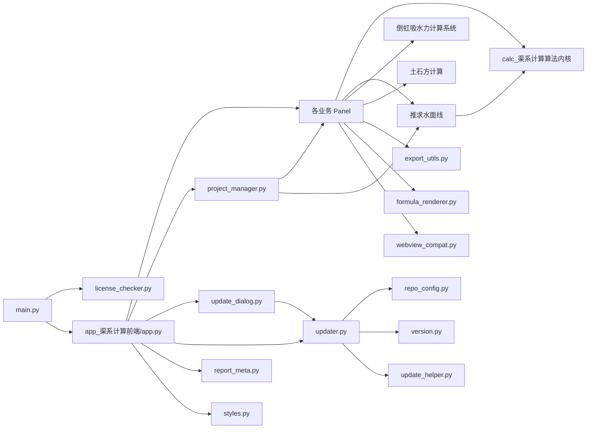

# 模块依赖地图

更新日期：2026-03-21

本文从“代码怎么连起来”这个角度描述仓库，而不是只列目录树。阅读本文件前，建议先看 [项目总览](./项目总览.md) 和 [启动链路说明](./启动链路说明.md)。

## 1. 说明与方法

本文的依赖结论来自两类信息：

1. 入口代码阅读：重点查看 `main.py`、`app.py`、`project_manager.py`、`updater.py`
2. 保守静态扫描：统计项目内 `.py` 文件之间的直接导入关系，忽略 `.venv/`、`dist/`、`build/`、`__pycache__/`

需要特别注意：
- 仓库中存在大量 `sys.path` 注入和运行时导入
- 因此“静态扫描结果”一定低估真实耦合度
- 尤其是中文裸模块导入、函数内导入和条件导入，不会全部体现在保守扫描里

## 2. 总体依赖图

## 3. 顶层依赖关系

### 3.1 启动入口层

- [../main.py](../main.py)
  - 导入 [../license_checker.py](../license_checker.py)
  - 导入 [../app_渠系计算前端/app.py](../app_渠系计算前端/app.py)

这是最外层的薄启动壳，本身并不承载复杂业务。

### 3.2 主壳装配层

- [../app_渠系计算前端/app.py](../app_渠系计算前端/app.py)
  - 依赖 `styles.py`
  - 依赖 `project_manager.py`
  - 依赖 `report_meta.py`
  - 依赖 `webview_compat.py`
  - 依赖 `update_dialog.py`
  - 依赖 `updater.py`
  - 依赖各业务面板 `open_channel/aqueduct/tunnel/culvert/siphon/pressure_pipe/water_profile`
  - 运行时依赖 `推求水面线.managers.siphon_manager` 和 `pressure_pipe_manager`

这层的角色不是“算法实现”，而是“对象接线板”。

### 3.3 业务面板层

当前主要面板位于：
- [../app_渠系计算前端/open_channel/panel.py](../app_渠系计算前端/open_channel/panel.py)
- [../app_渠系计算前端/aqueduct/panel.py](../app_渠系计算前端/aqueduct/panel.py)
- [../app_渠系计算前端/tunnel/panel.py](../app_渠系计算前端/tunnel/panel.py)
- [../app_渠系计算前端/culvert/panel.py](../app_渠系计算前端/culvert/panel.py)
- [../app_渠系计算前端/siphon/panel.py](../app_渠系计算前端/siphon/panel.py)
- [../app_渠系计算前端/pressure_pipe/panel.py](../app_渠系计算前端/pressure_pipe/panel.py)
- [../app_渠系计算前端/water_profile/panel.py](../app_渠系计算前端/water_profile/panel.py)
- [../app_渠系计算前端/batch/panel.py](../app_渠系计算前端/batch/panel.py)

它们一方面承担用户交互，另一方面也常常直接承担领域编排职责。

## 4. 各子系统的关键依赖路径

### 4.1 明渠、渡槽、隧洞、矩形暗涵

这一组模块的模式非常接近：
- 先把 `calc_渠系计算算法内核/` 注入 `sys.path`
- 再直接导入中文裸模块名
- 同时复用前端公共导出、公式渲染等能力

证据位置：
- [../app_渠系计算前端/open_channel/panel.py](../app_渠系计算前端/open_channel/panel.py)
  - `open_channel/panel.py:20` 注入内核路径
  - `open_channel/panel.py:71` 导入 `明渠设计`
- [../app_渠系计算前端/aqueduct/panel.py](../app_渠系计算前端/aqueduct/panel.py)
  - `aqueduct/panel.py:18` 注入内核路径
  - `aqueduct/panel.py:63` 导入 `渡槽设计`
- [../app_渠系计算前端/tunnel/panel.py](../app_渠系计算前端/tunnel/panel.py)
  - `tunnel/panel.py:17` 注入内核路径
  - `tunnel/panel.py:47` 导入 `隧洞设计`
- [../app_渠系计算前端/culvert/panel.py](../app_渠系计算前端/culvert/panel.py)
  - `culvert/panel.py:17` 注入内核路径
  - `culvert/panel.py:61` 导入 `矩形暗涵设计`

依赖模式可以概括为：

`panel.py` -> `calc_渠系计算算法内核/*.py` -> 公共导出/公式/样式

### 4.2 有压管道

[../app_渠系计算前端/pressure_pipe/panel.py](../app_渠系计算前端/pressure_pipe/panel.py) 的依赖路径是：
- `pressure_pipe/panel.py:15` 注入 `calc_渠系计算算法内核`
- `pressure_pipe/panel.py:36` 直接导入 `有压管道设计`
- `pressure_pipe/panel.py:50` 依赖 `formula_renderer`
- `pressure_pipe/panel.py:54` 依赖 `webview_compat`

这是“传统计算脚本 + 更现代的前端辅助层”混合的典型代表。

### 4.3 水面线

[../app_渠系计算前端/water_profile/panel.py](../app_渠系计算前端/water_profile/panel.py) 是耦合最复杂的业务面板之一：
- `water_profile/panel.py:29` 注入 `推求水面线/`
- `water_profile/panel.py:34` 注入 `calc_渠系计算算法内核/`
- `water_profile/panel.py:66` 依赖 `batch.panel`
- `water_profile/panel.py:78-80` 导入 `models.data_models`、`models.enums`、`core.calculator`
- `water_profile/panel.py:88` 导入 `shared.shared_data_manager`
- `water_profile/panel.py:5679` 运行时导入 `siphon.multi_siphon_dialog`

可以把它理解成一块桥接层：
- 向下连 `推求水面线/core`
- 横向连 `batch.panel`
- 横向连 `siphon` 多标签对话框
- 向上连主壳、导出和结果展示

### 4.4 倒虹吸

倒虹吸前端依赖明显跨两个子系统：
- [../app_渠系计算前端/siphon/panel.py](../app_渠系计算前端/siphon/panel.py)
  - `siphon/panel.py:30` 注入 `倒虹吸水力计算系统/`
  - `siphon/panel.py:64` 导入 `siphon_models`
  - `siphon/panel.py:71` 导入 `siphon_hydraulics`
  - `siphon/panel.py:1777` 和 `1981` 运行时导入 `推求水面线.managers.siphon_manager`
- [../app_渠系计算前端/siphon/multi_siphon_dialog.py](../app_渠系计算前端/siphon/multi_siphon_dialog.py)
  - `multi_siphon_dialog.py:33` 反向导入 `SiphonPanel`
  - `multi_siphon_dialog.py:40` 注入倒虹吸系统路径
  - `multi_siphon_dialog.py:45` 注入水面线路径
  - `multi_siphon_dialog.py:48` 导入 `SiphonManager`
  - `multi_siphon_dialog.py:55` 导入 `SiphonDataExtractor`

这说明倒虹吸模块本身也是“UI + 专业后端 + 水面线共享管理”的混合接线区。

### 4.5 土石方

土石方目录更像一个独立包：
- [../土石方计算/__init__.py](../土石方计算/__init__.py) 暴露 `EarthworkProject`
- `EarthworkProject` 在 `土石方计算/__init__.py:63`
- `PROJECT_FILE_SUFFIX` 为 `.earthwork.json`，位于 `土石方计算/__init__.py:76`
- `CACHE_DIR` 为 `.cache`，位于 `土石方计算/__init__.py:77`
- 前端面板在 [../土石方计算/ui/panel.py](../土石方计算/ui/panel.py)
  - `ui/panel.py:25` 引入 `panel_handlers`
  - `ui/panel.py:51` 定义 `EarthworkPanel`
  - `ui/panel.py:493` / `578` 提供与项目字典的互转

相对于其他子系统，土石方的边界更清晰，但目前尚未完全挂入主壳默认导航。

## 5. 静态扫描下的热点文件

以下统计来自保守静态扫描，只统计项目内 `.py` 之间的直接导入关系。由于存在运行时导入与路径注入，真实耦合可能更高。

### 5.1 扇出较高的文件

| 文件 | 直接依赖数 | 说明 |
| --- | ---: | --- |
| `app_渠系计算前端/app.py` | 18 | 主壳装配中心 |
| `土石方计算/ui/panel_handlers.py` | 15 | 土石方 UI 行为混入层 |
| `app_渠系计算前端/water_profile/panel.py` | 14 | 水面线业务编排中心 |
| `土石方计算/__init__.py` | 14 | 土石方门面类，聚合多个子模块 |
| `app_渠系计算前端/project_manager.py` | 13 | 生命周期治理中心 |
| `app_渠系计算前端/siphon/panel.py` | 10 | 倒虹吸面板热点 |
| `app_渠系计算前端/open_channel/panel.py` | 9 | 明渠面板 |
| `app_渠系计算前端/aqueduct/panel.py` | 8 | 渡槽面板 |
| `app_渠系计算前端/culvert/panel.py` | 8 | 暗涵面板 |

### 5.2 扇入较高的文件

| 文件 | 被依赖数 | 说明 |
| --- | ---: | --- |
| `app_渠系计算前端/styles.py` | 19 | 全局样式常量与通用 UI 辅助 |
| `app_渠系计算前端/siphon/panel.py` | 11 | 被多标签对话框等模块反向依赖 |
| `土石方计算/models/section.py` | 11 | 土石方共享断面模型 |
| `app_渠系计算前端/report_meta.py` | 10 | 多个模块复用的导出元数据入口 |
| `土石方计算/models/alignment.py` | 10 | 土石方线路模型 |
| `土石方计算/models/terrain.py` | 10 | 土石方地形模型 |
| `app_渠系计算前端/webview_compat.py` | 9 | HTML 结果展示兼容层 |
| `app_渠系计算前端/export_utils.py` | 8 | 导出能力复用层 |
| `app_渠系计算前端/formula_renderer.py` | 7 | 公式与 HTML 渲染公共层 |

这些数字说明一个事实：当前代码库的真正公共层不只有算法模型，前端工具层本身也高度共享。

## 6. 已确认的环依赖

静态扫描已确认一个明确环依赖：

- [../app_渠系计算前端/siphon/panel.py](../app_渠系计算前端/siphon/panel.py)
- [../app_渠系计算前端/siphon/multi_siphon_dialog.py](../app_渠系计算前端/siphon/multi_siphon_dialog.py)

证据：
- `multi_siphon_dialog.py:33` 直接导入 `SiphonPanel`
- `siphon/panel.py:1879`、`1893` 运行时导入 `MultiSiphonDialog`

影响：
- 增加初始化顺序敏感性
- 提高重构时的回归风险
- 让类型边界与职责归属变得不够清晰

## 7. 依赖风格上的三个结构特征

### 7.1 路径注入普遍存在

代表位置：
- `main.py:20`
- `app.py:15`
- `open_channel/panel.py:20`
- `aqueduct/panel.py:18`
- `tunnel/panel.py:17`
- `culvert/panel.py:17`
- `pressure_pipe/panel.py:15`
- `water_profile/panel.py:29`、`34`
- `siphon/panel.py:30`
- `multi_siphon_dialog.py:40`、`45`
- `推求水面线/core/calculator.py:16`、`21`

这说明仓库仍依赖“运行时调整解释器搜索路径”的老式组织方式，而不是完全依赖包化结构。

### 7.2 中文裸模块导入仍是常态

代表位置：
- `from 明渠设计 import ...`
- `from 渡槽设计 import ...`
- `from 隧洞设计 import ...`
- `from 矩形暗涵设计 import ...`
- `from 有压管道设计 import ...`
- `from 矩形暗涵设计 import calculate_rectangular_outputs`

这种方式对现有项目很直接，但对 IDE、类型检查、重构工具和跨平台运行都不够友好。

### 7.3 动态导入补足了静态图之外的真实耦合

代表位置：
- `water_profile/panel.py:5679` 运行时导入 `MultiSiphonDialog`
- `siphon/panel.py:1777`、`1981` 运行时导入 `SiphonConfig`
- `app.py:589` 启动时导入 `SilentUpdateChecker`

这意味着：
- 文本搜索和静态分析只能看到一部分真实耦合
- 改动模块边界时必须结合运行路径一起看

## 8. 共享契约与跨模块公共层

当前最值得保护的“公共契约”主要有四类：

1. UI 公共层
   - [../app_渠系计算前端/styles.py](../app_渠系计算前端/styles.py)
   - [../app_渠系计算前端/export_utils.py](../app_渠系计算前端/export_utils.py)
   - [../app_渠系计算前端/formula_renderer.py](../app_渠系计算前端/formula_renderer.py)
   - [../app_渠系计算前端/webview_compat.py](../app_渠系计算前端/webview_compat.py)

2. 水面线共享模型层
   - [../推求水面线/models/data_models.py](../推求水面线/models/data_models.py)
   - [../推求水面线/models/enums.py](../推求水面线/models/enums.py)

3. 项目状态治理层
   - [../app_渠系计算前端/project_manager.py](../app_渠系计算前端/project_manager.py)
   - [../app_渠系计算前端/report_meta.py](../app_渠系计算前端/report_meta.py)

4. 产品工程层
   - [../version.py](../version.py)
   - [../repo_config.py](../repo_config.py)
   - [../updater.py](../updater.py)
   - [../update_helper.py](../update_helper.py)

## 9. 开发者阅读建议

如果你是为了“改某个功能”，建议从对应面板入手；如果你是为了“改结构”，建议按下面顺序：

1. [../app_渠系计算前端/app.py](../app_渠系计算前端/app.py)
2. [../app_渠系计算前端/project_manager.py](../app_渠系计算前端/project_manager.py)
3. [../app_渠系计算前端/water_profile/panel.py](../app_渠系计算前端/water_profile/panel.py)
4. [../app_渠系计算前端/siphon/panel.py](../app_渠系计算前端/siphon/panel.py)
5. [../推求水面线/core/calculator.py](../推求水面线/core/calculator.py)
6. [../推求水面线/models/data_models.py](../推求水面线/models/data_models.py)
7. [../updater.py](../updater.py)

## 10. 对后续重构最有价值的结论

- 当前最关键的不是“目录够不够多”，而是“装配点太集中”
- `app.py`、`water_profile/panel.py`、`siphon/panel.py` 已经承担过多接线职责
- `sys.path` 注入与裸模块导入让真实依赖图比表面更复杂
- 土石方子系统相对最接近独立包形态，可以作为未来整理边界的参考样式
- 如果要做包化或解耦，应优先保护共享模型层、项目状态治理层和更新工程层
